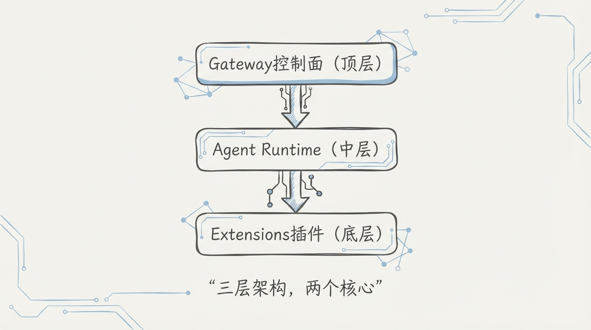
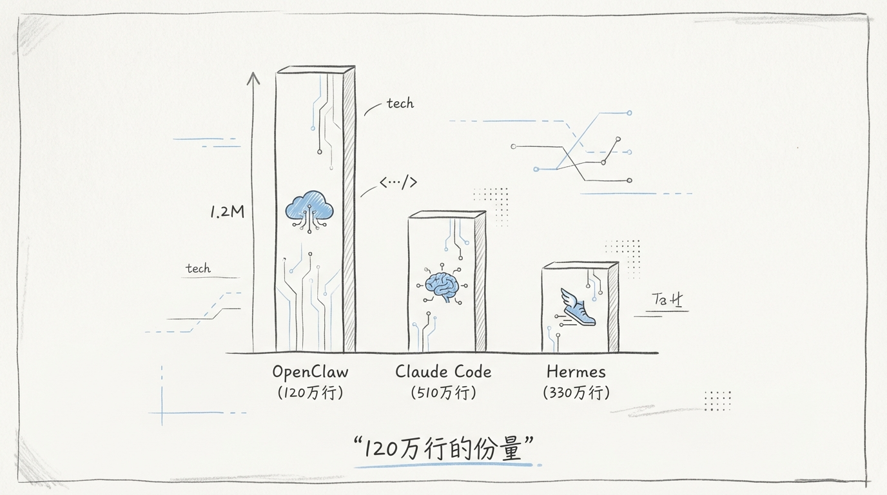
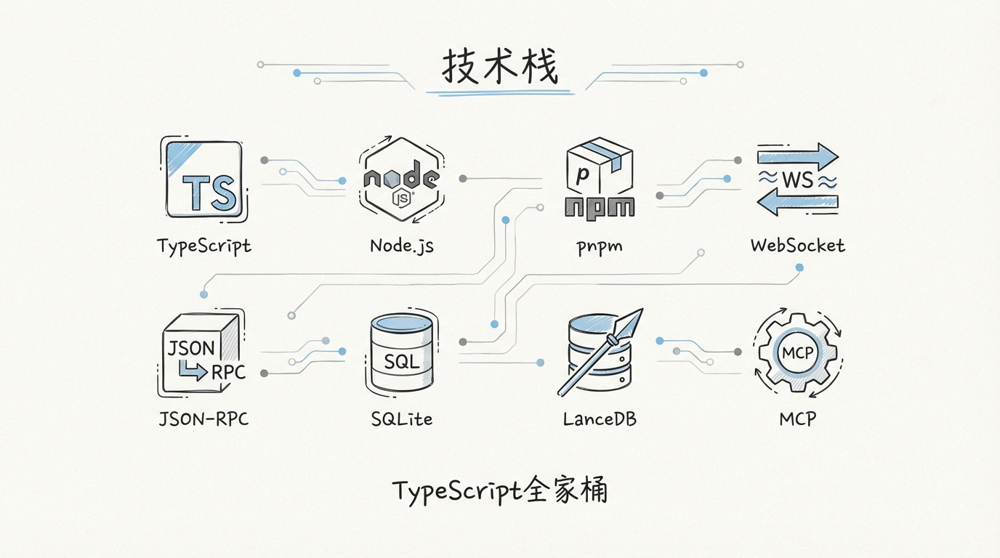
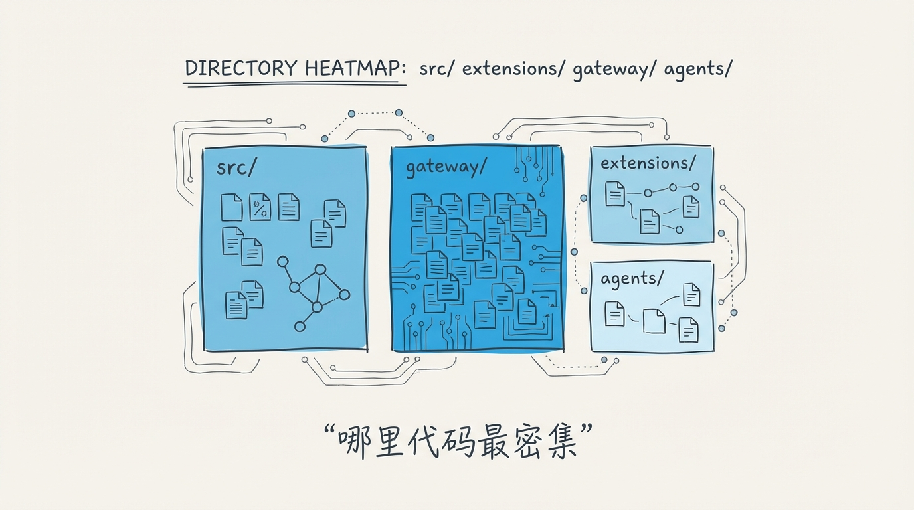
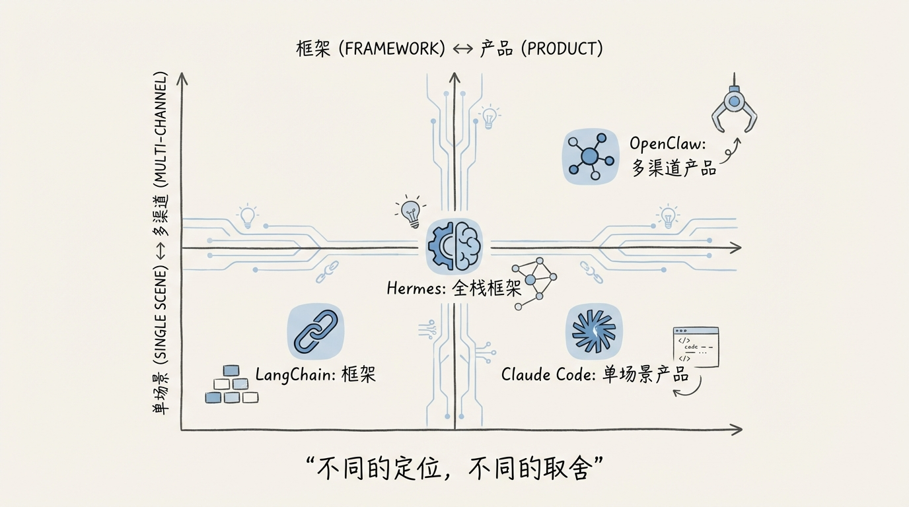
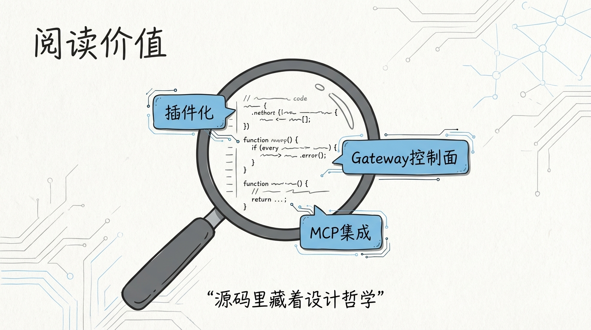
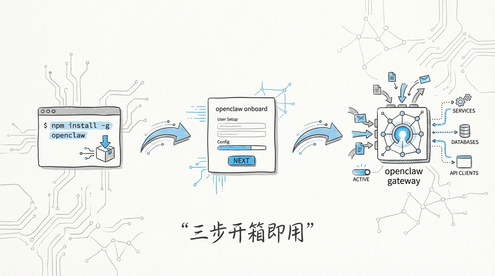
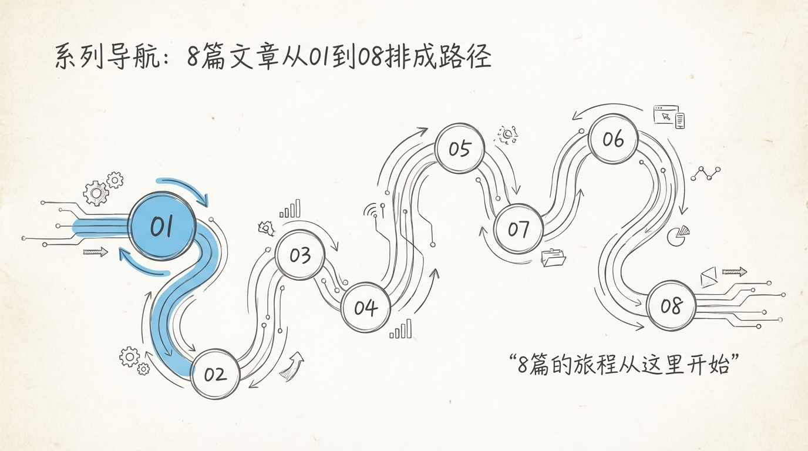

[English](docs/01-Architecture-Overview.md)

# 01 OpenClaw 全景图：120 万行 TypeScript 的个人 AI 助手平台


大多数人听到 **120 万行 TypeScript** 的第一反应是：谁写得出来？第二反应是：谁维护得了？

Peter Steinberger 给出了一个反直觉的答案。这个以 PSPDFKit 闻名的奥地利开发者，没有选择 Python 生态里遍地的 LangChain / AutoGen 方案，而是用纯 TypeScript 硬搓了一个 **全栈 AI 助手平台**。6,259 个源文件，294 个 Gateway 核心文件，90+ Extensions 插件，MIT 协议开源。

别急着觉得这是一个人的玩具项目。当你看完整套架构，你会发现它的野心是做 **AI 时代的个人操作系统**。

---

## 1️⃣ 这个项目到底在解决什么问题


市面上的 AI 助手方案分两类：

1. **云端托管型**，比如 ChatGPT、Claude.ai。你的数据在别人的服务器上，你没有任何控制权
2. **本地运行型**，比如 Ollama + Open WebUI。你有控制权，但能力被锁死在一个聊天框里

OpenClaw 走了 **第三条路**：一个跑在你自己设备上的控制面，通过 WebSocket 连接你的手机、电脑、浏览器，然后用插件系统把 30+ LLM Provider 和 23+ 消息渠道串成一张网。

你可以在 WhatsApp 里跟它对话，它背后调的是 Claude 3.5 Sonnet；也可以在 Telegram 里让它帮你发邮件，它通过 Gmail Extension 直接操作你的邮箱。**所有数据留在你本地，所有能力通过插件扩展。**

这跟 Self-hosted Bitwarden 的逻辑一样。你不需要信任任何第三方，你就是自己的 SaaS。

---

## 2️⃣ 整体架构：三层蛋糕



OpenClaw 的架构可以用一张图讲清楚：

```
┌─────────────────────────────────────────────────────┐
│                   Client Layer                       │
│  WhatsApp │ Telegram │ Slack │ Discord │ Web UI │ …  │
└──────────────────────┬──────────────────────────────┘
                       │ WebSocket + JSON-RPC v14.0
                       ▼
┌─────────────────────────────────────────────────────┐
│               Gateway 控制面                         │
│  ┌──────────┐ ┌──────────┐ ┌──────────┐            │
│  │ call.ts  │ │ auth.ts  │ │ ws-conn  │            │
│  │ 30,872L  │ │ 15,601L  │ │ .ts      │   ...      │
│  │ RPC 分发  │ │ 认证系统  │ │ WS 管理  │            │
│  └──────────┘ └──────────┘ └──────────┘            │
│  294 个核心文件 │ HTTP + WebSocket 双协议             │
└──────────────────────┬──────────────────────────────┘
                       │ Extension API
                       ▼
┌─────────────────────────────────────────────────────┐
│              Extensions 插件层                       │
│  ┌─────────┐ ┌─────────┐ ┌─────────┐ ┌─────────┐  │
│  │ LLM     │ │ Channel │ │ Tool    │ │ Storage │  │
│  │Providers│ │Adapters │ │Actions  │ │ Bridges │  │
│  │ 30+     │ │ 23+     │ │ 40+     │ │ 5+      │  │
│  └─────────┘ └─────────┘ └─────────┘ └─────────┘  │
│  90+ Extensions │ 每个插件独立 npm 包                │
└──────────────────────┬──────────────────────────────┘
                       │
                       ▼
┌─────────────────────────────────────────────────────┐
│              Agent Runtime 运行时                    │
│  LLM 调度 │ 上下文管理 │ Memory │ Tool Calling      │
└─────────────────────────────────────────────────────┘
```

三层各司其职：

- **Gateway 控制面** 是大脑。它处理所有 WebSocket 连接、认证、设备配对、RPC 方法分发。一个 `call.ts` 文件 30,872 行，里面塞了 **150 个 JSON-RPC 方法**。这是整个项目最重的单文件，没有之一
- **Extensions 插件层** 是四肢。每个插件是一个独立 npm 包，实现标准的 Extension API 接口。LLM Provider、消息渠道、工具动作、存储桥接，四类插件覆盖了 AI 助手的所有触点
- **Agent Runtime** 是肌肉记忆。负责 LLM 调度、上下文窗口管理、记忆持久化、Tool Calling 协议转换

**Gateway 不碰业务逻辑，Extensions 不碰连接管理。** 这个分层是整个 120 万行代码能维护下来的关键。

---

## 3️⃣ 代码规模：用数字说话



| 指标 | 数值 | 说明 |
|------|------|------|
| 总代码行数 | **1,200,000+** | 纯 TypeScript，不含依赖 |
| 源文件数 | **6,259** | `.ts` + `.tsx` |
| Gateway 文件数 | **294** | 控制面核心 |
| Extensions 数量 | **90+** | 独立插件包 |
| LLM Providers | **30+** | OpenAI/Anthropic/Google/混元… |
| 消息渠道 | **23+** | WhatsApp/Telegram/Slack/Discord… |
| 包管理 | **pnpm workspace** | monorepo 结构 |
| 协议版本 | **JSON-RPC v14.0** | 自定义 RPC 协议 |

6,259 个文件意味着什么？做个参照：VS Code 的核心源码大约 5,000 个 TypeScript 文件。OpenClaw 的体量已经超过了大多数人日常使用的编辑器。

**一个个人项目，做到了商业级 IDE 的代码量。** 这要么是过度工程，要么是真有这么多东西要做。读完源码你会发现，是后者。

---

## 4️⃣ 技术栈解剖



```
Runtime:     Node.js 20+ (ESM)
Language:    TypeScript 5.x (strict mode)
Package:     pnpm workspace (monorepo)
Protocol:    WebSocket + JSON-RPC v14.0
Build:       esbuild / tsup
Test:        vitest
Lint:        ESLint + Prettier
CI/CD:       GitHub Actions
```

几个值得注意的选择：

1. **纯 TypeScript**，没有一行 Python。在 AI 领域这是少数派。LangChain 是 Python，AutoGen 是 Python，CrewAI 是 Python。OpenClaw 赌的是 TypeScript 的类型系统能在 120 万行规模上兜住复杂度
2. **pnpm workspace monorepo**，90+ Extensions 每个都是独立包。你可以只装你需要的插件，不用背着 WhatsApp 适配器去跑 Telegram
3. **WebSocket 长连接** 而非 HTTP 轮询。Gateway 和客户端之间维持一条持久连接，消息延迟降到毫秒级。这对聊天场景来说是刚需
4. **JSON-RPC v14.0** 是自定义协议版本。标准 JSON-RPC 只到 2.0，OpenClaw 在此基础上扩展了认证握手、设备配对、分片传输等能力，迭代到了 v14

---

## 5️⃣ 目录结构速览

```
openclaw/
├── src/
│   ├── gateway/           # 🧠 控制面（294 文件）
│   │   ├── call.ts        #    RPC 方法分发（30,872 行）
│   │   ├── auth.ts        #    认证系统（15,601 行）
│   │   ├── ws-connection.ts #  WebSocket 连接管理
│   │   ├── http-listen.ts #    HTTP 服务层
│   │   ├── pairing.ts     #    设备配对
│   │   └── tls.ts         #    TLS 证书管理
│   ├── extensions/        # 🦾 插件层（90+ 插件）
│   │   ├── llm-openai/    #    OpenAI Provider
│   │   ├── llm-anthropic/ #    Anthropic Provider
│   │   ├── channel-whatsapp/ # WhatsApp 适配器
│   │   ├── channel-telegram/ # Telegram 适配器
│   │   ├── tool-email/    #    邮件工具
│   │   └── ...
│   ├── agent/             # 💪 Agent Runtime
│   │   ├── runtime.ts     #    运行时核心
│   │   ├── context.ts     #    上下文管理
│   │   ├── memory.ts      #    记忆系统
│   │   └── tool-calling.ts #   工具调用协议
│   ├── shared/            # 📦 公共工具库
│   └── types/             # 📐 类型定义
├── packages/              # 独立发布的子包
├── docs/                  # 文档
├── package.json
├── pnpm-workspace.yaml
└── tsconfig.json
```



**Gateway 是心脏，Extensions 是器官，Agent Runtime 是神经系统。** 读 OpenClaw 源码的正确路线是：先搞懂 Gateway 怎么收发消息，再看 Extensions 怎么挂载能力，最后看 Agent 怎么编排一次完整的对话。

---

## 6️⃣ 和同类项目的定位差异



| 维度 | OpenClaw | Hermes Agent | Claude Code |
|------|----------|-------------|-------------|
| **定位** | 个人 AI 助手平台 | AI Agent 框架 | AI 编程助手 |
| **运行位置** | 用户自有设备 | 云端/本地 | 终端 CLI |
| **核心能力** | 多渠道消息 + 多 LLM + 插件 | Agent 编排 + 工具链 | 代码生成 + 文件操作 |
| **架构模式** | WebSocket Gateway + Plugin | DAG Workflow | REPL Loop |
| **扩展方式** | npm Extension 包 | Python Tool 函数 | MCP Server |
| **消息渠道** | 23+ 原生适配器 | 无，需自行集成 | 仅终端 |
| **LLM 支持** | 30+ Provider | 可配置 | Claude 系列 |
| **协议** | JSON-RPC v14.0 | HTTP REST | 私有协议 |
| **语言** | TypeScript | Python | TypeScript |
| **代码量** | 1.2M 行 | ~50K 行 | ~200K 行 |

三个项目的差异用一句话就能讲清楚：

**OpenClaw 是操作系统，Hermes Agent 是应用框架，Claude Code 是单个应用。**

OpenClaw 不关心你用哪个 LLM、在哪个聊天软件里对话、让 AI 帮你干什么。它只关心一件事：**把所有这些东西连起来，然后让你完全控制。** 这是平台思维，跟 Kubernetes 不管你跑什么容器是一个逻辑。

Hermes Agent 的重心在 **Agent 编排**。给你 DAG、给你工具链、给你 ReAct 循环，但消息从哪来、结果往哪发，你自己搞。

Claude Code 更纯粹，就是一个 **终端里的编程搭档**。它不需要 23 个消息渠道，因为终端就是它唯一的渠道。

---

## 7️⃣ 为什么值得读这套源码



120 万行代码不是用来从头到尾读完的。但有几个模块值得逐行拆：

1. **Gateway 的 RPC 分发机制**。一个 30,872 行的 `call.ts` 如何用 switch-case + 策略模式处理 150 个方法，同时保证类型安全。这套 pattern 可以直接搬到任何 TypeScript 后端项目
2. **认证系统的零信任设计**。`auth.ts` 15,601 行实现了设备配对、Pairing Code、TLS 双向认证。对于任何需要端到端加密的场景，这是一份可以抄的作业
3. **插件系统的依赖注入**。90+ 插件如何做到按需加载、热插拔、互不影响。这套插件架构的抽象层设计，比大多数所谓的微内核框架都干净
4. **WebSocket 连接的生命周期管理**。断线重连、心跳检测、分片传输、背压控制。这些在生产环境里踩坑最多的问题，OpenClaw 都有现成的解法

这个系列文章会按照 **Gateway → Extensions → Agent Runtime** 的顺序，逐层拆解核心代码。每篇文章对应一个模块，贴真实源码，给架构图，标注关键设计决策。

---

## 8️⃣ 系列文章路线图

| 篇号 | 标题 | 核心模块 |
|------|------|----------|
| 01 | 全景图（本篇） | 整体架构 |
| 02 | Gateway 控制面 | `call.ts` / `auth.ts` / `ws-connection.ts` |
| 03 | Extensions 插件系统 | 插件加载 / 依赖注入 / 生命周期 |
| 04 | LLM Provider 适配层 | 30+ Provider 的统一抽象 |
| 05 | Channel 消息渠道 | WhatsApp / Telegram / Slack 适配器 |
| 06 | Agent Runtime | LLM 调度 / 上下文 / Memory |
| 07 | Tool Calling 协议 | 函数调用 / 结果回传 / 错误处理 |
| 08 | 安全模型 | E2E 加密 / 零信任 / TLS |
| 09 | 部署与运维 | Docker / 自建实例 / 监控 |
| 10 | 二次开发指南 | 自定义 Extension / Gateway 扩展 |

---

## 9️⃣ 本地跑起来



```bash
# 克隆仓库
git clone https://github.com/openclaw/openclaw.git
cd openclaw

# 安装依赖（pnpm monorepo）
pnpm install

# 启动 Gateway
pnpm run dev:gateway

# 在另一个终端启动 Web UI
pnpm run dev:web
```

Gateway 默认监听 `ws://localhost:3000`，Web UI 默认在 `http://localhost:5173`。首次启动会生成一个 **Pairing Code**，用手机客户端扫码即可完成设备配对。

对于 TME-Claw 这样的企业级部署场景，你需要额外配置 TLS 证书和反向代理，这个我们在第 09 篇会详细展开。

---



**下一篇** → [02 Gateway 控制面：WebSocket + JSON-RPC 的 150 个方法](02-Gateway控制面.md)

这 30,872 行的 `call.ts`，到底是怎么把 150 个 RPC 方法塞进一个文件还不崩的？
