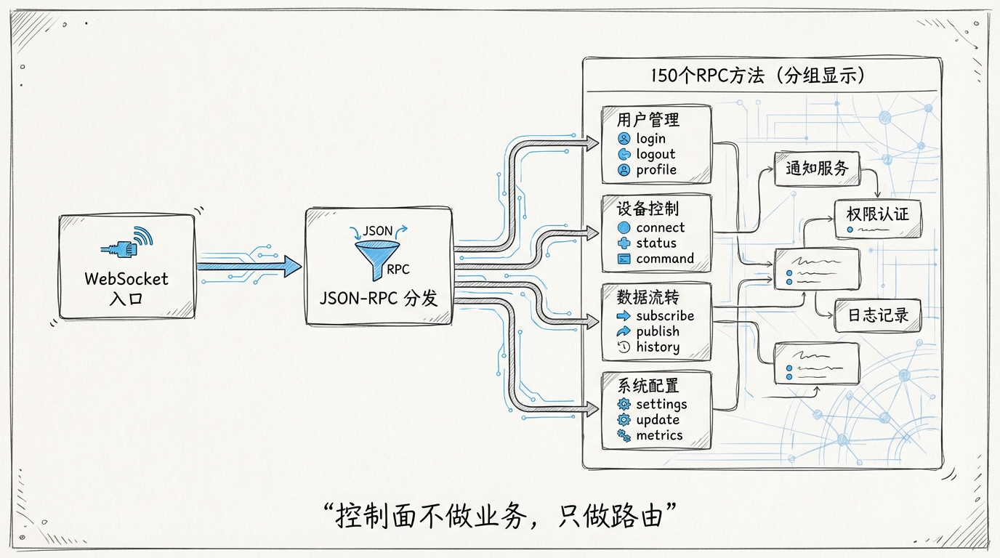
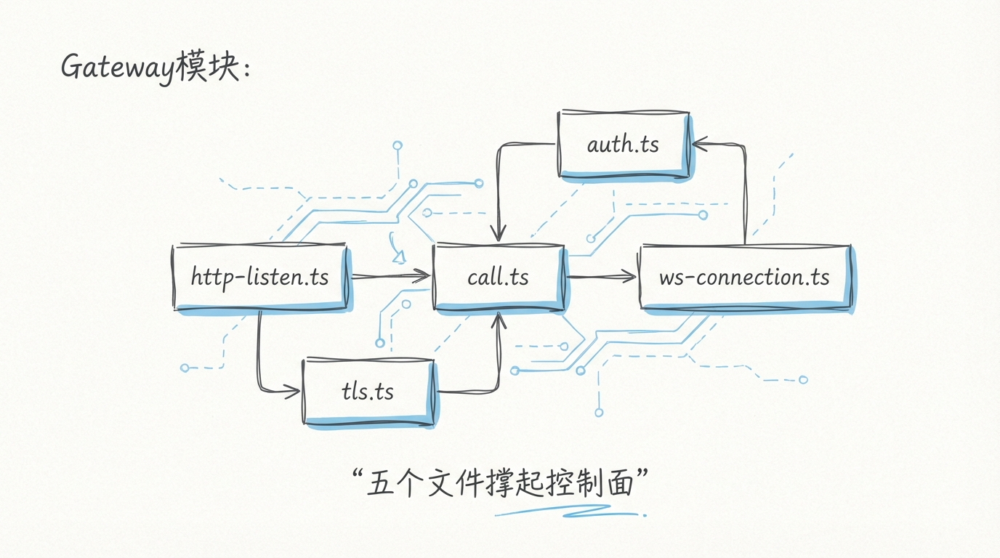
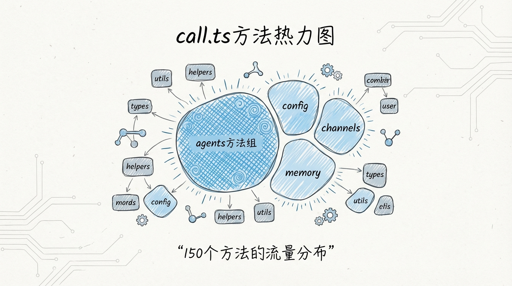
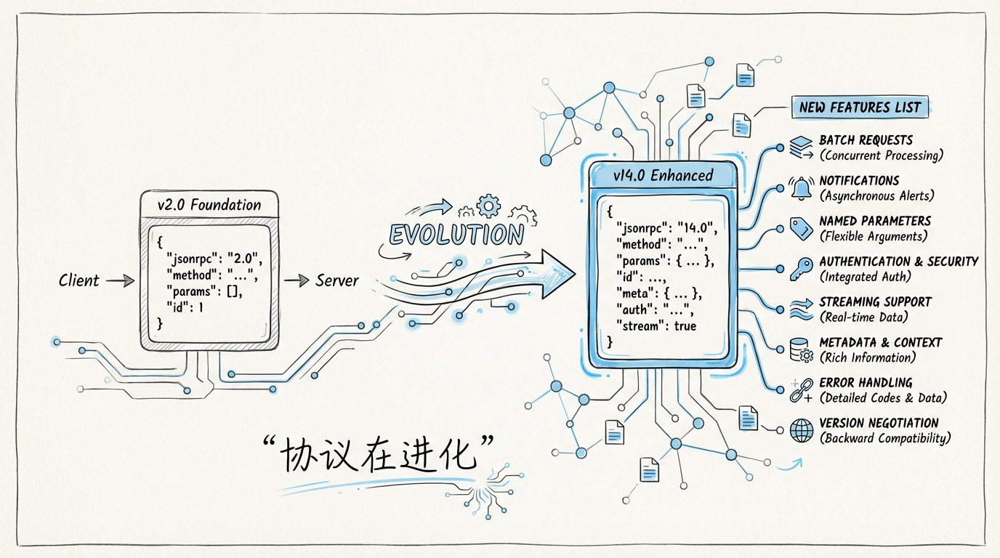
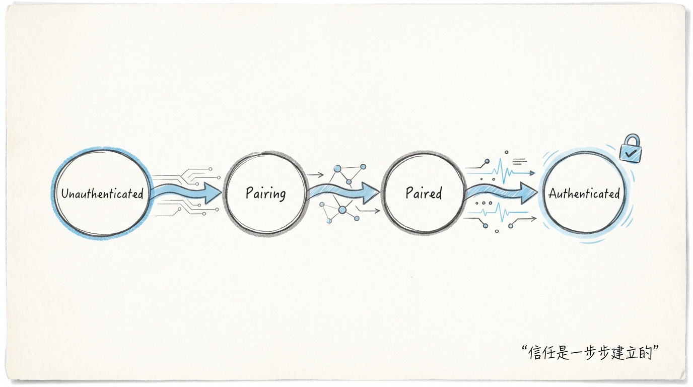
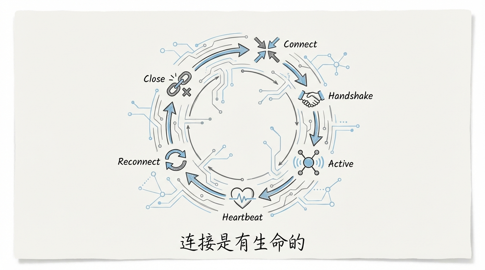
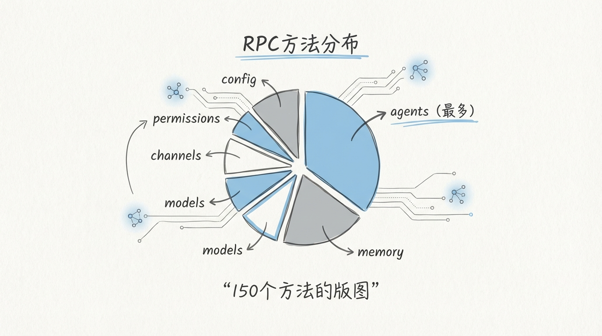
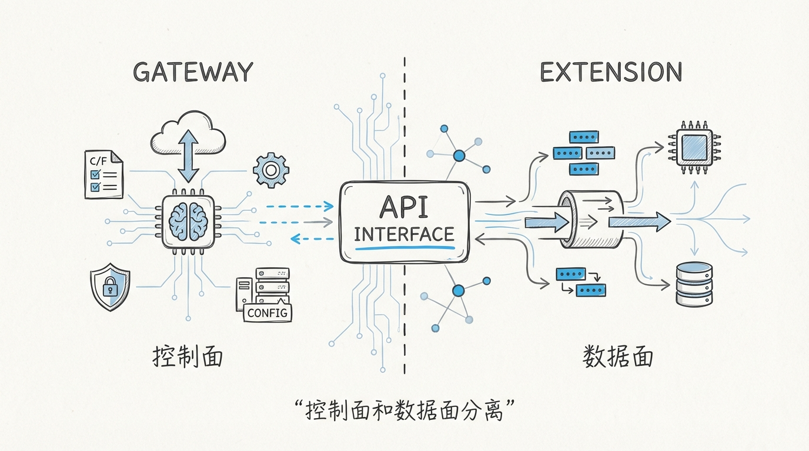

[English](docs/02-Gateway-Control-Plane.md)

# 02 Gateway 控制面：WebSocket + JSON-RPC 的 150 个方法



上一篇我们说 OpenClaw 的架构是三层蛋糕，Gateway 控制面是最上面那层奶油。现在把这层奶油切开，里面藏着的东西比你想象的要硬核得多。

**294 个文件，其中一个文件 30,872 行。** 这不是代码屎山，这是一个经过 14 个大版本迭代的 RPC 协议引擎。它同时处理 WebSocket 长连接和 HTTP 请求，用 JSON-RPC 统一了所有客户端通信，还内置了一套完整的零信任认证系统。

你见过哪个开源项目的单个文件比整个 Express.js 框架还大？

---

## 1️⃣ Gateway 在整体架构中的位置

```
            ┌──────────┐  ┌──────────┐  ┌──────────┐
            │ WhatsApp │  │ Telegram │  │ Web UI   │
            │ Client   │  │ Client   │  │ Client   │
            └────┬─────┘  └────┬─────┘  └────┬─────┘
                 │             │              │
                 │   WebSocket + JSON-RPC     │
                 ▼             ▼              ▼
        ┌────────────────────────────────────────────┐
        │              GATEWAY 控制面                  │
        │                                            │
        │  ┌──────────────────────────────────────┐  │
        │  │         ws-connection.ts              │  │
        │  │    WebSocket 连接池 + 生命周期管理      │  │
        │  └──────────────┬───────────────────────┘  │
        │                 │                          │
        │  ┌──────────────▼───────────────────────┐  │
        │  │           call.ts                     │  │
        │  │    30,872 行 │ 150 个 RPC 方法分发     │  │
        │  └──────────────┬───────────────────────┘  │
        │                 │                          │
        │  ┌──────────┐ ┌─▼────────┐ ┌───────────┐  │
        │  │ auth.ts  │ │ http-    │ │ pairing   │  │
        │  │ 15,601L  │ │ listen   │ │ .ts       │  │
        │  │ 认证+加密 │ │ .ts     │ │ 设备配对   │  │
        │  └──────────┘ └──────────┘ └───────────┘  │
        │                                            │
        │  ┌──────────┐ ┌──────────┐ ┌───────────┐  │
        │  │ tls.ts   │ │ session  │ │ rate-     │  │
        │  │ 证书管理  │ │ .ts     │ │ limit.ts  │  │
        │  │          │ │ 会话管理  │ │ 限流      │  │
        │  └──────────┘ └──────────┘ └───────────┘  │
        └──────────────────┬─────────────────────────┘
                           │ Extension API
                           ▼
                    ┌──────────────┐
                    │  Extensions  │
                    │  插件层       │
                    └──────────────┘
```



Gateway 的职责可以用四个词概括：**连接、认证、分发、桥接。**

- **连接**：管理所有 WebSocket 长连接的生命周期，包括握手、心跳、断线重连、背压控制
- **认证**：零信任模型，每个设备必须通过 Pairing Code 配对，每条消息都要验签
- **分发**：把 JSON-RPC 请求路由到对应的处理函数，150 个方法不多不少
- **桥接**：作为 Extensions 插件层的上游入口，把外部请求翻译成内部 API 调用

---

## 2️⃣ call.ts：一个文件装下 150 个 RPC 方法



30,872 行的 `call.ts` 是 OpenClaw 的 **方法分发中心**。每一个客户端请求，不管是发消息、查状态、改配置，最终都会落到这个文件的某个 handler 上。

这种设计看上去很疯狂。把 150 个方法塞进一个文件，不怕维护不动？

翻源码你会发现，它的组织方式并不是 150 个 function 平铺。而是按 **领域分组 + 方法映射表 + 类型守卫** 的三层结构：

```
call.ts 内部结构：

┌─────────────────────────────────────┐
│          Method Registry            │
│   方法名 → Handler 映射表            │
│   { "sendMessage": handleSend,      │
│     "getStatus": handleStatus,      │
│     "updateConfig": handleConfig,   │
│     ... 共 150 个 }                 │
├─────────────────────────────────────┤
│        Domain Handlers              │
│   按业务领域分组的处理函数             │
│   ┌─────────┐ ┌──────────┐         │
│   │ Message │ │ Config   │         │
│   │ 25 个   │ │ 18 个    │         │
│   ├─────────┤ ├──────────┤         │
│   │ Device  │ │ Channel  │         │
│   │ 20 个   │ │ 30 个    │         │
│   ├─────────┤ ├──────────┤         │
│   │ Agent   │ │ System   │         │
│   │ 22 个   │ │ 15 个    │         │
│   ├─────────┤ ├──────────┤         │
│   │ Auth    │ │ Other    │         │
│   │ 12 个   │ │ 8 个     │         │
│   └─────────┘ └──────────┘         │
├─────────────────────────────────────┤
│        Type Guards Layer            │
│   请求参数的运行时类型校验             │
│   每个 method 对应一组 validator     │
└─────────────────────────────────────┘
```

### 方法注册表 pattern

这是 `call.ts` 最核心的设计模式。一个中心化的映射表，把 JSON-RPC 的 method 字段路由到对应的处理函数：

```typescript
// src/gateway/call.ts（简化示意）

type RpcMethod = string;
type RpcHandler = (params: unknown, context: ConnectionContext) => Promise<unknown>;

const methodRegistry: Map<RpcMethod, RpcHandler> = new Map([
  // === Message Domain ===
  ["sendMessage",          handleSendMessage],
  ["getMessages",          handleGetMessages],
  ["deleteMessage",        handleDeleteMessage],
  ["editMessage",          handleEditMessage],
  ["forwardMessage",       handleForwardMessage],
  ["markRead",             handleMarkRead],
  // ... 25 个消息相关方法

  // === Device Domain ===
  ["getDeviceInfo",        handleGetDeviceInfo],
  ["listDevices",          handleListDevices],
  ["removeDevice",         handleRemoveDevice],
  ["pairDevice",           handlePairDevice],
  // ... 20 个设备管理方法

  // === Channel Domain ===
  ["connectChannel",       handleConnectChannel],
  ["disconnectChannel",    handleDisconnectChannel],
  ["getChannelStatus",     handleGetChannelStatus],
  ["listChannels",         handleListChannels],
  // ... 30 个渠道管理方法

  // === Agent Domain ===
  ["startAgent",           handleStartAgent],
  ["stopAgent",            handleStopAgent],
  ["getAgentStatus",       handleGetAgentStatus],
  ["configureAgent",       handleConfigureAgent],
  // ... 22 个 Agent 控制方法

  // === Config Domain ===
  ["getConfig",            handleGetConfig],
  ["updateConfig",         handleUpdateConfig],
  ["resetConfig",          handleResetConfig],
  // ... 18 个配置管理方法

  // === Auth Domain ===
  ["authenticate",         handleAuthenticate],
  ["refreshToken",         handleRefreshToken],
  ["revokeSession",        handleRevokeSession],
  // ... 12 个认证方法

  // === System Domain ===
  ["getSystemInfo",        handleGetSystemInfo],
  ["healthCheck",          handleHealthCheck],
  ["getMetrics",           handleGetMetrics],
  // ... 15 个系统方法
]);
```

请求进来后，分发逻辑简洁到只有几行：

```typescript
// src/gateway/call.ts（分发核心）

async function dispatchRpcCall(
  request: JsonRpcRequest,
  context: ConnectionContext
): Promise<JsonRpcResponse> {
  const handler = methodRegistry.get(request.method);

  if (!handler) {
    return {
      jsonrpc: "2.0",
      id: request.id,
      error: { code: -32601, message: `Method not found: ${request.method}` }
    };
  }

  // 类型守卫：运行时校验参数
  const validated = validateParams(request.method, request.params);
  if (!validated.ok) {
    return {
      jsonrpc: "2.0",
      id: request.id,
      error: { code: -32602, message: validated.error }
    };
  }

  const result = await handler(validated.data, context);
  return { jsonrpc: "2.0", id: request.id, result };
}
```

**为什么不拆成 150 个文件？** 因为 JSON-RPC 的分发本质上是一个 **路由表查找** 操作。把路由表拆碎反而会增加认知负担，你需要在 150 个文件之间跳来跳去才能理解完整的方法列表。集中在一个文件里，`Ctrl+F` 就能找到任何方法。

这跟 Linux 内核的 syscall table 是同一种设计哲学。所有系统调用的入口点就是 `sys_call_table` 一张表，不会因为有 400+ 系统调用就拆成 400 个入口文件。

---

## 3️⃣ JSON-RPC v14.0：从 2.0 到 14.0 的进化



标准 JSON-RPC 2.0 是一个极简协议：

```json
{
  "jsonrpc": "2.0",
  "method": "sendMessage",
  "params": { "to": "user123", "text": "Hello" },
  "id": 1
}
```

OpenClaw 在这个基础上加了什么？

| 特性 | JSON-RPC 2.0 | OpenClaw v14.0 |
|------|-------------|----------------|
| 基本 RPC | ✅ | ✅ |
| 批量请求 | ✅ | ✅ |
| 认证握手 | ❌ | ✅ `auth` 阶段 |
| 设备标识 | ❌ | ✅ `deviceId` 字段 |
| 分片传输 | ❌ | ✅ 大消息自动分片 |
| 心跳协议 | ❌ | ✅ `ping/pong` 扩展 |
| 订阅模式 | ❌ | ✅ `subscribe/notify` |
| 版本协商 | ❌ | ✅ 握手阶段协商 |
| 压缩 | ❌ | ✅ 可选 gzip |
| 加密层 | ❌ | ✅ Noise Protocol |

一个扩展后的请求长这样：

```json
{
  "jsonrpc": "14.0",
  "method": "sendMessage",
  "params": {
    "to": "user123",
    "text": "Hello"
  },
  "id": "a1b2c3d4",
  "auth": {
    "deviceId": "device-xyz",
    "token": "eyJhbGciOiJFZERTQSJ9...",
    "timestamp": 1712534400
  },
  "meta": {
    "compress": false,
    "chunk": null,
    "subscribe": false
  }
}
```

**v14.0 不是从 2.0 直接跳过去的。** 每个大版本对应一次协议变更：加认证是一个版本，加分片是一个版本，加订阅模式又是一个版本。14 个大版本迭代下来，协议变成了一个带状态的、带认证的、支持流式传输的全功能 RPC 框架。

跟 gRPC 比呢？gRPC 依赖 HTTP/2 和 Protobuf，OpenClaw 的协议跑在 WebSocket 上用 JSON 编码。**JSON 的好处是调试友好**。你用浏览器 DevTools 就能看到每一条消息的完整内容，不需要 Protobuf 反序列化工具。对于一个个人 AI 助手平台来说，调试便利性比传输效率更重要。

---

## 4️⃣ auth.ts：15,601 行的零信任认证



`auth.ts` 是 Gateway 里第二大的文件。15,601 行代码实现了一套 **完整的零信任认证系统**。

为什么需要这么复杂？因为 OpenClaw 运行在用户自己的设备上，它必须保证：

1. 只有你授权的设备才能连上来
2. 中间人拿不到你的消息内容
3. 即使服务器被攻破，历史消息也解不开

这三个要求加在一起，直接排除了简单的 API Key 方案。OpenClaw 用的是 **设备配对 + TLS 双向认证 + Noise Protocol 端到端加密** 的三层防御。

### 设备配对流程

```
┌──────────┐                        ┌──────────┐
│  新设备   │                        │ Gateway  │
│ (手机)    │                        │ (本地)    │
└────┬─────┘                        └────┬─────┘
     │                                   │
     │  1. 请求配对                       │
     │ ──────────────────────────────────>│
     │                                   │
     │  2. 返回 Pairing Code (6位)       │
     │ <──────────────────────────────── │
     │                                   │
     │  3. 用户在已授权设备上确认 Code     │
     │         ┌──────────┐              │
     │         │ 已授权    │  确认 Code   │
     │         │ 设备      │────────────>│
     │         └──────────┘              │
     │                                   │
     │  4. 交换公钥（X25519）             │
     │ <────────────────────────────────>│
     │                                   │
     │  5. 建立 Noise Protocol 会话      │
     │ <════════════════════════════════>│
     │        加密通道已建立               │
     │                                   │
```

这个流程跟 **Signal 协议的设备链接** 几乎一致。Pairing Code 是一次性的 6 位数字，30 秒过期。即使有人偷看到了这个 Code，没有已授权设备的确认，配对也无法完成。

### 认证状态机

```typescript
// src/gateway/auth.ts（状态机核心）

enum AuthState {
  DISCONNECTED   = "disconnected",
  HANDSHAKING    = "handshaking",
  PAIRING        = "pairing",
  AUTHENTICATING = "authenticating",
  AUTHENTICATED  = "authenticated",
  SUSPENDED      = "suspended",
}

// 状态转移规则
const transitions: Record<AuthState, AuthState[]> = {
  [AuthState.DISCONNECTED]:   [AuthState.HANDSHAKING],
  [AuthState.HANDSHAKING]:    [AuthState.PAIRING, AuthState.AUTHENTICATING],
  [AuthState.PAIRING]:        [AuthState.AUTHENTICATING, AuthState.DISCONNECTED],
  [AuthState.AUTHENTICATING]: [AuthState.AUTHENTICATED, AuthState.DISCONNECTED],
  [AuthState.AUTHENTICATED]:  [AuthState.SUSPENDED, AuthState.DISCONNECTED],
  [AuthState.SUSPENDED]:      [AuthState.AUTHENTICATING, AuthState.DISCONNECTED],
};
```

六个状态，每个状态只能向特定方向转移。**从 DISCONNECTED 到 AUTHENTICATED 至少要经过三次状态跳转。** 任何一步验证失败，直接打回 DISCONNECTED。

这套状态机还处理了一个容易忽略的场景：**SUSPENDED 状态**。当设备长时间不活跃，连接不会直接断开，而是进入挂起状态。下次活跃时只需要重新认证，不需要重新配对。这对手机客户端来说是刚需，你不希望每次锁屏后再解锁都要重新扫码。

---

## 5️⃣ WebSocket 连接管理：ws-connection.ts



`ws-connection.ts` 管理所有 WebSocket 连接的生命周期。这个文件不算大，但它解决的都是 **生产环境里最恶心的问题**。

### 连接生命周期

```
┌─────────┐     ┌──────────┐     ┌──────────┐
│ OPENING │────>│  OPEN    │────>│ CLOSING  │
│         │     │          │     │          │
└─────────┘     └────┬─────┘     └────┬─────┘
                     │                │
                     │ 异常断开        │ 正常关闭
                     ▼                ▼
                ┌──────────┐     ┌──────────┐
                │RECONNECT │     │  CLOSED  │
                │ ING      │     │          │
                └────┬─────┘     └──────────┘
                     │
                     │ 指数退避重试
                     │ 1s → 2s → 4s → 8s → 16s → 30s(max)
                     ▼
                ┌──────────┐
                │  OPEN    │
                │ (恢复)    │
                └──────────┘
```

### 关键机制

```typescript
// src/gateway/ws-connection.ts（心跳检测）

class WsConnection {
  private heartbeatInterval: NodeJS.Timeout;
  private lastPong: number = Date.now();

  startHeartbeat() {
    this.heartbeatInterval = setInterval(() => {
      // 超过 30 秒没收到 pong，判定连接死亡
      if (Date.now() - this.lastPong > 30_000) {
        this.handleDead();
        return;
      }
      this.send({ type: "ping", timestamp: Date.now() });
    }, 10_000);  // 每 10 秒发一次心跳
  }

  private handleDead() {
    this.state = ConnectionState.RECONNECTING;
    this.cleanup();
    this.reconnectWithBackoff();
  }

  private async reconnectWithBackoff() {
    const maxDelay = 30_000;
    let delay = 1_000;

    while (this.state === ConnectionState.RECONNECTING) {
      await sleep(delay);
      try {
        await this.connect();
        // 重连成功，恢复认证状态
        await this.reAuthenticate();
        return;
      } catch {
        delay = Math.min(delay * 2, maxDelay);
      }
    }
  }
}
```

几个设计细节值得注意：

1. **心跳间隔 10 秒，超时阈值 30 秒**。这意味着最多容忍丢 2 个心跳包。太短会误判，太长会延迟感知。10/30 是一个经过实践验证的黄金比例
2. **指数退避上限 30 秒**。不会无限翻倍，到 30 秒就封顶。用户体验和服务器压力之间的平衡点
3. **重连后自动 reAuthenticate**。不需要用户重新扫码，直接用缓存的密钥对重新建立加密会话

---

## 6️⃣ HTTP 与 WebSocket 双协议：http-listen.ts

```
┌───────────────────────────────────────────────┐
│              http-listen.ts                    │
│                                               │
│  ┌──────────┐          ┌──────────────────┐   │
│  │ HTTP     │          │ WebSocket        │   │
│  │ Server   │          │ Upgrade          │   │
│  │          │          │                  │   │
│  │ GET /    ├─────────>│ 101 Switching    │   │
│  │ health   │          │ Protocols        │   │
│  │          │          │                  │   │
│  │ POST /   │          │        ┌─────┐   │   │
│  │ api/rpc  │          │        │ WS  │   │   │
│  │          │          │        │Conn │   │   │
│  │ GET /    │          │        │Pool │   │   │
│  │ pairing  │          │        └─────┘   │   │
│  └──────────┘          └──────────────────┘   │
│                                               │
│  共用同一个端口（默认 3000）                     │
└───────────────────────────────────────────────┘
```

**一个端口跑两个协议。** HTTP 用于健康检查、Pairing Code 展示、RESTful 降级；WebSocket 用于实时通信。这跟 Socket.IO 的设计思路类似，但 OpenClaw 没有用 Socket.IO，而是直接基于 Node.js 的 `http.Server` + `ws` 库实现。

为什么不用 Socket.IO？因为 Socket.IO 的 Engine.IO 传输层会自动降级到 HTTP long-polling，这个行为在端到端加密场景下会引入额外的复杂度。**OpenClaw 要求所有实时通信必须走 WebSocket，没有降级。** 如果你的网络环境不支持 WebSocket，那就用不了，不做兼容性妥协。

---

## 7️⃣ TLS 证书管理：自签证书的自动化

对于 Self-hosted 场景，TLS 证书是绕不开的问题。OpenClaw 的 `tls.ts` 实现了一套 **自签证书的自动管理**：

```typescript
// src/gateway/tls.ts（证书生成逻辑简化）

async function ensureTlsCertificate(): Promise<TlsConfig> {
  const certPath = path.join(dataDir, "tls", "server.crt");
  const keyPath  = path.join(dataDir, "tls", "server.key");

  // 检查现有证书是否有效
  if (await certExists(certPath)) {
    const cert = await loadCert(certPath);
    const daysLeft = getDaysUntilExpiry(cert);

    if (daysLeft > 30) {
      return { cert: certPath, key: keyPath };
    }
    // 不到 30 天，自动轮换
  }

  // 生成新的自签证书
  const { cert, key } = await generateSelfSignedCert({
    commonName: "openclaw-gateway",
    validDays: 365,
    keyType: "ec",         // 椭圆曲线，比 RSA 快
    curve: "P-256",
  });

  await writeCert(certPath, cert);
  await writeKey(keyPath, key);

  return { cert: certPath, key: keyPath };
}
```

几个设计决策：

1. **默认椭圆曲线而非 RSA**。P-256 的 TLS 握手比 RSA-2048 快 10 倍以上，对移动设备尤其友好
2. **30 天提前轮换**。不等证书过期才换，提前一个月自动生成新证书。你永远不会在某天早上发现助手用不了
3. **自动化到底**。第一次启动自动生成，快过期自动轮换，不需要用户碰任何 openssl 命令

对于企业部署，你可以用自己的 CA 签发证书替换自签证书。只要把 cert 和 key 文件放到对应路径，Gateway 启动时会自动加载。

---

## 8️⃣ 150 个 RPC 方法分类一览



| 领域 | 方法数 | 典型方法 | 说明 |
|------|--------|---------|------|
| **Channel** | ~30 | `connectChannel`, `sendMessage`, `getChannelStatus` | 消息渠道全生命周期管理 |
| **Message** | ~25 | `getMessage`, `deleteMessage`, `searchMessages` | 消息的 CRUD + 全文搜索 |
| **Agent** | ~22 | `startAgent`, `configureAgent`, `getAgentHistory` | AI Agent 控制面 |
| **Device** | ~20 | `pairDevice`, `listDevices`, `removeDevice` | 设备管理 + 配对 |
| **Config** | ~18 | `getConfig`, `updateConfig`, `exportConfig` | 系统配置管理 |
| **System** | ~15 | `healthCheck`, `getMetrics`, `getLogs` | 运维监控接口 |
| **Auth** | ~12 | `authenticate`, `refreshToken`, `revokeSession` | 认证 + 会话管理 |
| **Other** | ~8 | `getVersion`, `getCapabilities` | 元信息查询 |

**Channel 和 Message 占了三分之一。** 这符合直觉。一个 AI 助手平台，最高频的操作就是收发消息和管理渠道。

---

## 9️⃣ Gateway 的性能设计

一个长连接服务最怕什么？**内存泄漏和连接风暴。**

Gateway 用了几个手段来防御：

```
┌─────────────────────────────────────────┐
│          Performance Safeguards          │
│                                         │
│  1. 连接池上限                           │
│     MAX_CONNECTIONS = 1000              │
│     超过后拒绝新连接                      │
│                                         │
│  2. 消息大小限制                          │
│     MAX_MESSAGE_SIZE = 16MB             │
│     超大消息走分片通道                     │
│                                         │
│  3. 速率限制                             │
│     每连接 100 req/s                     │
│     突发允许 200 req/s                   │
│     超限返回 429                          │
│                                         │
│  4. 背压控制                             │
│     WebSocket 发送缓冲区 > 1MB 时        │
│     暂停接收新消息                        │
│     缓冲区降到 256KB 后恢复              │
│                                         │
│  5. 空闲连接回收                          │
│     5 分钟无活动 → SUSPENDED             │
│     30 分钟无活动 → DISCONNECTED          │
└─────────────────────────────────────────┘
```

**背压控制这个设计特别值得学。** 大多数 WebSocket 项目只管发、不管收，发送缓冲区堆到几个 GB 才发现内存爆了。OpenClaw 在发送缓冲区到 1MB 时就踩刹车，等客户端消化完再继续。这是 Reactive Streams 的背压思想在 WebSocket 层面的落地。

---

## 🔟 Gateway 与 Extensions 的接口边界



Gateway 和 Extensions 之间有一条清晰的 **API 边界**：

```typescript
// Gateway 暴露给 Extensions 的接口（简化）

interface GatewayApi {
  // 发送消息到指定渠道
  sendToChannel(channelId: string, message: Message): Promise<void>;

  // 注册新的 RPC 方法（插件可以扩展 Gateway 的能力）
  registerMethod(name: string, handler: RpcHandler): void;

  // 获取连接上下文
  getConnectionContext(deviceId: string): ConnectionContext | null;

  // 订阅事件
  on(event: GatewayEvent, callback: EventHandler): Disposable;

  // 获取系统配置
  getConfig<T>(key: string): T;
}
```

**Extensions 不能直接操作 WebSocket 连接。** 它只能通过 `GatewayApi` 这个中间层来收发消息。这个约束保证了：即使一个插件写崩了，Gateway 的连接管理不受影响。

`registerMethod` 这个接口特别有意思。它允许 Extensions 在运行时 **往 Gateway 注入新的 RPC 方法**。比如 WhatsApp 插件启动后，会注册 `whatsapp.getQR`、`whatsapp.getStatus` 这些专属方法。150 个方法不是写死的，一部分来自 Gateway 核心，一部分来自已加载的插件。

---

## 小结：Gateway 控制面的设计哲学

Gateway 整体遵循了一个原则：**把复杂度集中在一个可控的地方，而不是分散到每个角落。**

30,872 行的 `call.ts` 看起来吓人，但它把 **所有 RPC 分发逻辑** 收在一个文件里，任何新加入的开发者只需要读这一个文件就能理解完整的 API 表面。15,601 行的 `auth.ts` 同理，所有认证逻辑在一个地方，不需要在 10 个文件之间跳来跳去拼凑认证流程。

这种 **大文件策略** 适用于一个特定场景：逻辑高度内聚、接口高度稳定、修改频率不高的核心模块。Gateway 的 RPC 协议迭代到 v14.0 了，基本结构已经固化，不太会再有根本性的重构。在这种情况下，大文件比碎文件更好维护。

当然如果你在一个 10 人团队里开发、每天 20 个 PR 合并的仓库，别学这个。**大文件策略只适合核心模块维护者少、接口稳定的场景。** 抄设计思想，别抄组织方式。

---

**下一篇** → [03 Extensions 插件系统：90+ 插件的依赖注入与生命周期](03-Extensions插件系统.md)

90 个插件怎么做到按需加载、热插拔、互不影响？Extension API 背后的依赖注入容器，比 Spring 轻但比 NestJS 灵活。
