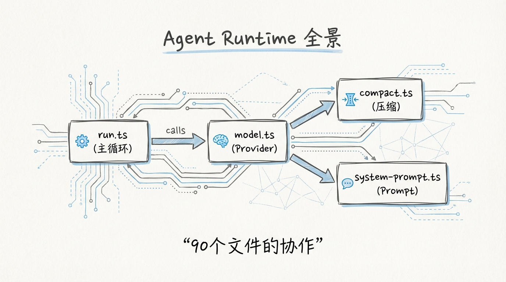
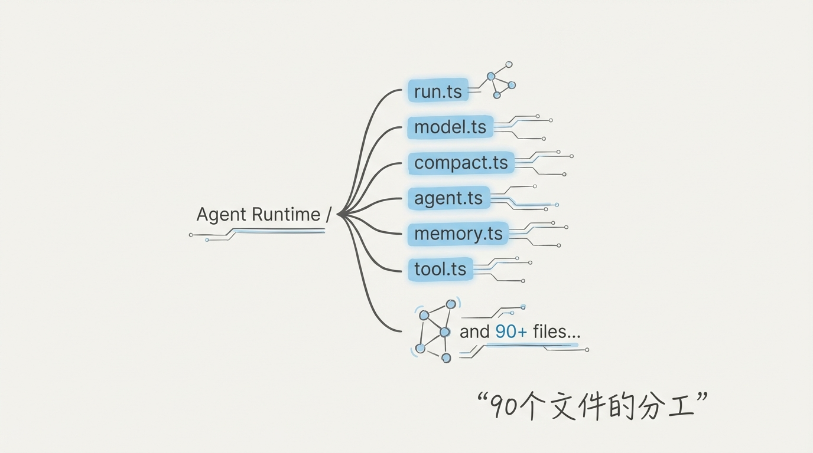
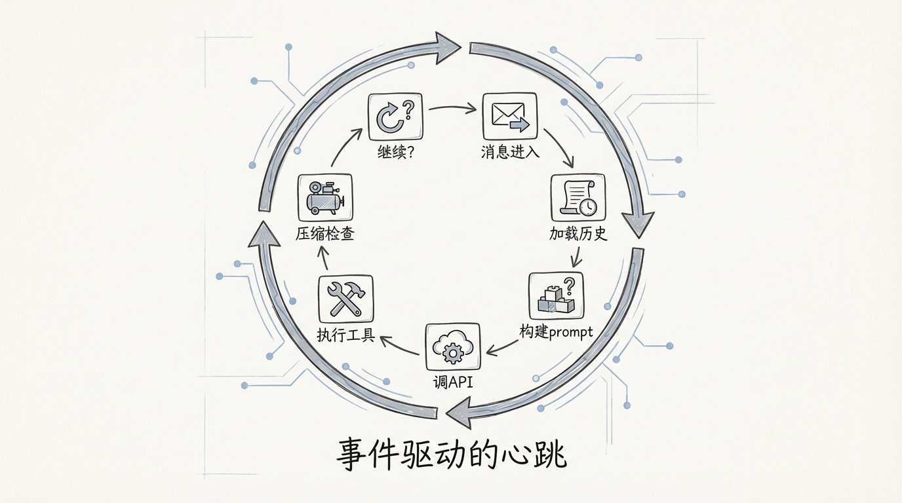
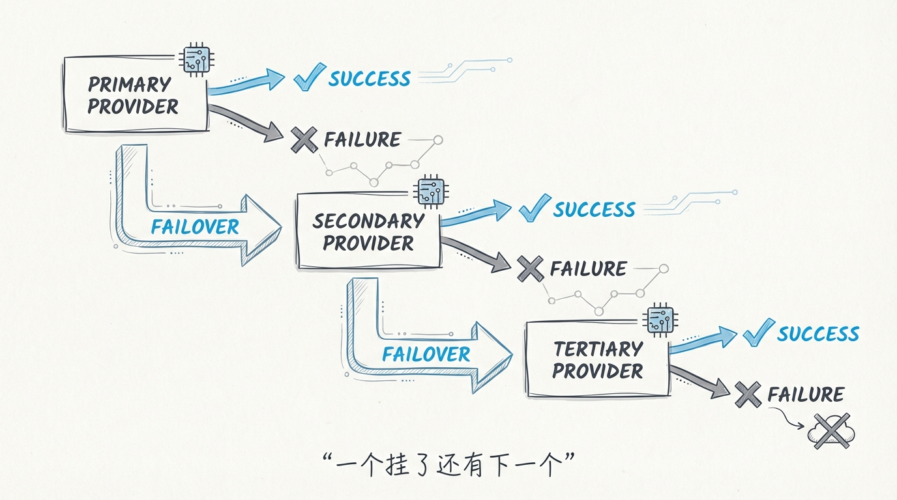
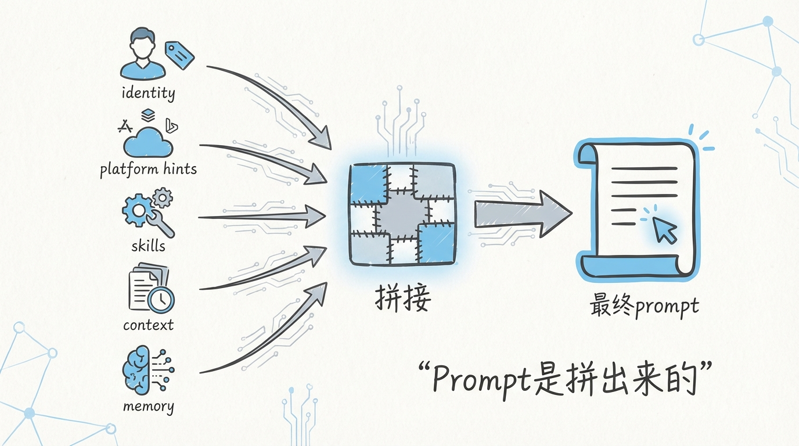
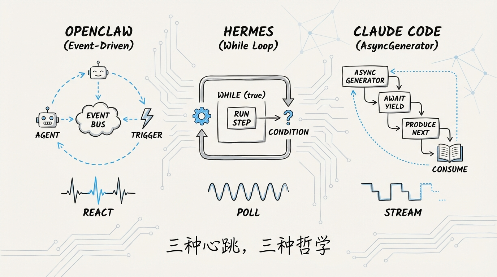
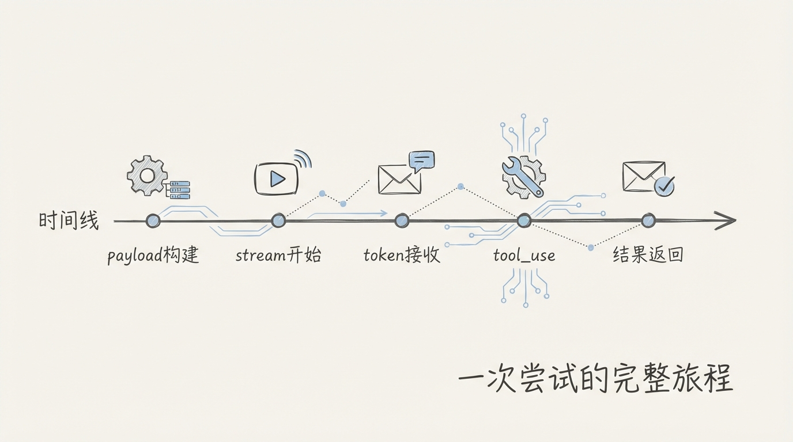

[English](docs/03-Agent-Runtime.md)

# 03 Agent Runtime：对话循环的事件驱动实现



大多数 AI Agent 框架的核心循环长这样：收到消息 → 调模型 → 解析工具调用 → 执行工具 → 把结果喂回模型 → 重复。听起来就是一个 while 循环套几个 if-else。

OpenClaw 的 Agent Runtime 也是 while 循环。但这个循环里藏着 **failover 决策树、auth profile 轮转、overflow compaction 自动恢复、跨 Provider 流式标准化** 和 **tool result 智能截断**。一个 `run.ts` 文件的 import 列表就有 90 行，比很多项目的整个入口文件都长。

这不是过度工程，这是在生产环境里跟 30+ LLM Provider 的各种奇葩错误搏斗后，长出来的免疫系统。

---

## 1️⃣ 目录结构：一个 Runner 的全部器官



`src/agents/pi-embedded-runner/` 是 Agent Runtime 的核心目录，文件按职责清晰分层：

```
src/agents/pi-embedded-runner/
├── run.ts                          ← 主循环入口，while(true) 重试引擎
├── run/
│   ├── attempt.ts                  ← 单次 LLM 调用的完整生命周期
│   ├── auth-controller.ts          ← Auth Profile 轮转控制器
│   ├── failover-observation.ts     ← Failover 决策日志
│   ├── helpers.ts                  ← 错误分类 + Usage 构建
│   ├── params.ts                   ← 运行参数类型定义
│   ├── payloads.ts                 ← 请求 payload 构建
│   └── setup.ts                    ← 模型 + Hook 初始化
├── model.ts                        ← Provider 发现 + 模型解析
├── compact.ts                      ← 上下文压缩（详见第 06 篇）
├── system-prompt.ts                ← 动态 System Prompt 组装
├── skills-runtime.ts               ← 技能集发现与注入
├── tool-result-truncation.ts       ← 大 Tool Result 智能截断
├── usage-accumulator.ts            ← Token 用量追踪累加器
├── history.ts                      ← 历史轮次裁剪
├── anthropic-stream-wrappers.ts    ← Anthropic 流式适配
├── openai-stream-wrappers.ts       ← OpenAI 流式适配
├── google-stream-wrappers.ts       ← Google 流式适配
├── bedrock-stream-wrappers.ts      ← Bedrock 流式适配
├── moonshot-stream-wrappers.ts     ← Moonshot/Kimi 流式适配
├── minimax-stream-wrappers.ts      ← MiniMax 流式适配
├── zai-stream-wrappers.ts          ← Zai 流式适配
└── proxy-stream-wrappers.ts        ← 代理透传适配
```

每个文件都是一个独立器官。`run.ts` 是心脏，`model.ts` 是眼睛，`compact.ts` 是肾脏，stream wrappers 是翻译官团队。

---

## 2️⃣ run.ts 主循环：一个披着 while 外衣的状态机



`runEmbeddedPiAgent()` 是整个 Agent Runtime 的入口。它的签名很简单，返回一个 `EmbeddedPiRunResult`，但内部是一台精密的 **重试状态机**。

```
┌─────────────────────────────────────────────────────────────┐
│                    runEmbeddedPiAgent()                      │
│                                                             │
│  ┌─────────────┐    ┌──────────────┐    ┌───────────────┐  │
│  │ 解析 Model  │───▶│ 初始化 Auth  │───▶│ 进入主循环    │  │
│  │ + Provider  │    │ Profile 队列 │    │ while(true)   │  │
│  └─────────────┘    └──────────────┘    └──────┬────────┘  │
│                                                │           │
│  ┌─────────────────────────────────────────────▼────────┐  │
│  │                   while (true)                        │  │
│  │                                                       │  │
│  │  ┌──────────────────┐                                 │  │
│  │  │ runEmbeddedAttempt│──── 成功 ────▶ 返回结果        │  │
│  │  └────────┬─────────┘                                 │  │
│  │           │ 失败                                      │  │
│  │           ▼                                           │  │
│  │  ┌──────────────────┐                                 │  │
│  │  │ 错误分类引擎      │                                 │  │
│  │  │                  │                                 │  │
│  │  │ ├ context_overflow → compaction → retry            │  │
│  │  │ ├ auth_error     → rotate profile → retry         │  │
│  │  │ ├ rate_limit     → backoff → retry                │  │
│  │  │ ├ timeout        → compaction/retry               │  │
│  │  │ ├ billing_error  → surface to user                │  │
│  │  │ └ overloaded     → exponential backoff → retry    │  │
│  │  └──────────────────┘                                 │  │
│  │                                                       │  │
│  │  Guard: runLoopIterations >= MAX_RUN_LOOP_ITERATIONS  │  │
│  │         → 终止并返回错误                               │  │
│  └───────────────────────────────────────────────────────┘  │
└─────────────────────────────────────────────────────────────┘
```

核心代码路径：

```typescript
// src/agents/pi-embedded-runner/run.ts

const MAX_TIMEOUT_COMPACTION_ATTEMPTS = 2;
const MAX_OVERFLOW_COMPACTION_ATTEMPTS = 3;
const MAX_RUN_LOOP_ITERATIONS = resolveMaxRunRetryIterations(profileCandidates.length);

while (true) {
  if (runLoopIterations >= MAX_RUN_LOOP_ITERATIONS) {
    // 超过最大重试次数，返回错误
    return { payloads: [{ text: "Request failed after repeated internal retries.", isError: true }] };
  }
  runLoopIterations += 1;

  // 检测运行时模型切换
  const nextSelection = resolvePersistedLiveSelection();
  if (hasDifferentLiveSessionModelSelection(resolveCurrentLiveSelection(), nextSelection)) {
    throw new LiveSessionModelSwitchError(nextSelection);
  }

  const attempt = await runEmbeddedAttempt({ /* 30+ 参数 */ });
  // ... 错误分类与重试决策
}
```

**MAX_RUN_LOOP_ITERATIONS 的计算方式值得注意。** 它不是一个硬编码常量，而是根据 Auth Profile 候选数动态计算。有 3 个 API Key 可以轮转？重试上限就比只有 1 个 Key 的场景更高。这是用概率思维在做工程决策。

---

## 3️⃣ model.ts：Provider 选择与 Failover 机制



`resolveModelAsync()` 是模型解析的入口。它做三件事：

1. 从配置和插件系统中 **发现所有可用模型**
2. 把 Provider + ModelId 解析成一个带完整元数据的 `Model<Api>` 对象
3. 通过 Plugin Runtime Hooks **允许插件介入模型解析流程**

```typescript
// src/agents/pi-embedded-runner/model.ts

function normalizeResolvedTransportApi(api: unknown): ModelDefinitionConfig["api"] | undefined {
  switch (api) {
    case "anthropic-messages":
    case "bedrock-converse-stream":
    case "github-copilot":
    case "google-generative-ai":
    case "ollama":
    case "openai-codex-responses":
    case "openai-completions":
    case "openai-responses":
      return api;
    default:
      return undefined;
  }
}
```

8 种 Transport API，对应 8 种完全不同的请求格式和流式响应协议。`model.ts` 的工作就是把这些差异 **在进入主循环之前就抹平**。

Failover 的决策链更有意思。`run.ts` 里的错误处理不是简单的 catch-retry，而是一棵 **分类决策树**：

| 错误类型 | 识别方式 | 处理策略 | 重试上限 |
|---------|---------|---------|---------|
| Context Overflow | `isLikelyContextOverflowError()` | 触发 compaction → 重试 | 3 次 |
| Auth 失败 | `isAuthAssistantError()` | 轮转到下一个 Profile | Profile 数量 |
| Rate Limit | `isRateLimitAssistantError()` | 指数退避 → 重试 | 全局上限内 |
| Timeout | `isTimeoutErrorMessage()` | compaction + 重试 | 2 次 |
| Billing 错误 | `isBillingAssistantError()` | 直接返回给用户 | 0 |
| Overloaded | `classifyFailoverReason() === "overloaded"` | 指数退避等待 | 全局上限内 |
| 模型不存在 | model 解析返回 null | 抛出 FailoverError | 0 |

**每种错误都有专属的 Auth Profile 影响评估。** Timeout 不会把当前 Profile 标记为失败，因为超时可能是网络问题；但 401/403 会立即标记 Profile 异常，防止后续请求继续用一个已经失效的 Key。

---

## 4️⃣ Stream Wrappers：跨 Provider 的流式标准化层

每个 LLM Provider 的流式响应格式都不一样。Anthropic 用 SSE，OpenAI 用 SSE 但字段名不同，Google 用自己的 GenerativeAI 协议，Bedrock 用 AWS 的 Converse Stream，Moonshot 又有自己的 thinking payload 格式。

OpenClaw 的解法是给每个 Provider 写一个 **Stream Wrapper**：

```
┌────────────────────────────────────────────────────────┐
│              Stream Wrapper 标准化层                     │
│                                                        │
│  ┌──────────────────┐    ┌──────────────────────────┐  │
│  │ anthropic-stream  │    │ 职责：                    │  │
│  │ -wrappers.ts      │    │ 1. 注入 Beta Headers     │  │
│  │                   │    │ 2. 1M Context 标记       │  │
│  │                   │    │ 3. OAuth Token 识别      │  │
│  │                   │    │ 4. Cache Retention 控制  │  │
│  └──────────────────┘    └──────────────────────────┘  │
│                                                        │
│  ┌──────────────────┐    ┌──────────────────────────┐  │
│  │ openai-stream     │    │ 职责：                    │  │
│  │ -wrappers.ts      │    │ 1. Service Tier 选择     │  │
│  │                   │    │ 2. Reasoning Effort 映射 │  │
│  │                   │    │ 3. Attribution Headers   │  │
│  │                   │    │ 4. Responses API 适配    │  │
│  └──────────────────┘    └──────────────────────────┘  │
│                                                        │
│  ┌──────────────────┐    ┌──────────────────────────┐  │
│  │ google-stream     │    │ 职责：                    │  │
│  │ -wrappers.ts      │    │ 1. ThinkingLevel 映射    │  │
│  │                   │    │ 2. ThinkingBudget 修复   │  │
│  │                   │    │ 3. Gemini 3.1 兼容      │  │
│  └──────────────────┘    └──────────────────────────┘  │
│                                                        │
│  ┌──────────────────┐    ┌──────────────────────────┐  │
│  │ bedrock-stream    │    │ 职责：                    │  │
│  │ -wrappers.ts      │    │ 1. 禁用 Cache（不支持）  │  │
│  │                   │    │ 2. Anthropic 模型识别    │  │
│  └──────────────────┘    └──────────────────────────┘  │
│                                                        │
│  ┌──────────────────┐    ┌──────────────────────────┐  │
│  │ moonshot-stream   │    │ 职责：                    │  │
│  │ -wrappers.ts      │    │ 1. SiliconFlow 兼容     │  │
│  │                   │    │ 2. Thinking Payload 转换 │  │
│  │                   │    │ 3. Ollama Kimi 适配     │  │
│  └──────────────────┘    └──────────────────────────┘  │
└────────────────────────────────────────────────────────┘
```

以 Anthropic 的 wrapper 为例：

```typescript
// src/agents/pi-embedded-runner/anthropic-stream-wrappers.ts

const ANTHROPIC_CONTEXT_1M_BETA = "context-1m-2025-08-07";
const ANTHROPIC_1M_MODEL_PREFIXES = ["claude-opus-4", "claude-sonnet-4"] as const;

const PI_AI_DEFAULT_ANTHROPIC_BETAS = [
  "fine-grained-tool-streaming-2025-05-14",
  "interleaved-thinking-2025-05-14",
] as const;
```

**每个 Provider 都有自己的坑。** Anthropic 需要 Beta Header 才能用 1M Context 和 Thinking；Google 的 `thinkingBudget` 在某些 Gemini 3.1 模型上会返回 -1，必须手动修复；Bedrock 根本不支持 Cache，必须在 wrapper 层强制关闭。

Stream Wrapper 的设计模式是 **装饰器链**。每个 wrapper 接收一个 `StreamFn`，返回一个新的 `StreamFn`，通过 `streamWithPayloadPatch()` 在发送前修改 payload：

```typescript
// src/agents/pi-embedded-runner/google-stream-wrappers.ts

export function createGoogleThinkingPayloadWrapper(
  baseStreamFn: StreamFn | undefined,
  thinkingLevel?: ThinkLevel,
): StreamFn {
  const underlying = baseStreamFn ?? streamSimple;
  return (model, context, options) => {
    return streamWithPayloadPatch(underlying, model, context, options, (payload) => {
      if (model.api === "google-generative-ai") {
        sanitizeGoogleThinkingPayload({ payload, modelId: model.id, thinkingLevel });
      }
    });
  };
}
```

这跟 Express 的中间件模式一脉相承。区别在于 Express 中间件处理的是 HTTP 请求，Stream Wrapper 处理的是 **LLM 流式调用的 payload**。

---

## 5️⃣ system-prompt.ts：动态 Prompt 的组装工厂



`buildEmbeddedSystemPrompt()` 接收 **30+ 个参数**，组装出最终的 System Prompt。这不是字符串拼接，这是一条 **生产线**。

```typescript
// src/agents/pi-embedded-runner/system-prompt.ts

export function buildEmbeddedSystemPrompt(params: {
  workspaceDir: string;
  defaultThinkLevel?: ThinkLevel;
  reasoningLevel?: ReasoningLevel;
  extraSystemPrompt?: string;
  ownerNumbers?: string[];
  reasoningTagHint: boolean;
  heartbeatPrompt?: string;
  skillsPrompt?: string;
  docsPath?: string;
  ttsHint?: string;
  reactionGuidance?: { level: "minimal" | "extensive"; channel: string };
  runtimeInfo: {
    agentId?: string; host: string; os: string; arch: string;
    node: string; model: string; provider?: string;
    capabilities?: string[]; channel?: string;
    channelActions?: string[];
  };
  tools: AgentTool[];
  modelAliasLines: string[];
  userTimezone: string;
  contextFiles?: EmbeddedContextFile[];
  memoryCitationsMode?: MemoryCitationsMode;
}): string
```

System Prompt 的内容是 **上下文感知** 的。同一个 Agent，在 Telegram 上运行和在 Discord 上运行，生成的 Prompt 不一样。用的是 Claude 还是 GPT-4，Prompt 也不一样。因为：

- Telegram 渠道会注入 **Reaction Guidance**（告诉模型可以用 emoji 反应）
- Discord 渠道会注入 **Channel Actions**（告诉模型可以创建 thread）
- Anthropic Provider 会启用 **Reasoning Tag Hint**
- 有 TTS 配置时会注入 **语音合成格式提示**

`createSystemPromptOverride()` 提供了完全覆盖的能力，让 compaction 等场景可以用精简版 prompt 替换完整版，节省 token。

---

## 6️⃣ tool-result-truncation.ts：大结果的智能截断

LLM 的工具调用经常返回巨量文本。一个 `cat` 命令读取一个大文件，返回几十万字符的内容，直接塞进上下文窗口就炸了。

`tool-result-truncation.ts` 的策略是 **head+tail 智能截断**：

```typescript
// src/agents/pi-embedded-runner/tool-result-truncation.ts

const MAX_TOOL_RESULT_CONTEXT_SHARE = 0.3;   // 单个结果最多占 30% 上下文
const HARD_MAX_TOOL_RESULT_CHARS = 400_000;   // 硬上限 400K 字符（~100K tokens）
const MIN_KEEP_CHARS = 2_000;                 // 至少保留 2K 字符

const TRUNCATION_SUFFIX =
  "\n\n⚠️ [Content truncated — original was too large for the model's context window. " +
  "The content above is a partial view. ...]";
```

关键设计：**不是无脑截头部**。`hasImportantTail()` 函数会检查文本末尾是否包含错误信息、JSON 结构、summary 等关键内容：

```typescript
function hasImportantTail(text: string): boolean {
  const tail = text.slice(-2000).toLowerCase();
  return (
    /\b(error|exception|failed|fatal|traceback|panic|stack trace|errno|exit code)\b/.test(tail) ||
    /\}\s*$/.test(tail.trim()) ||    // JSON 闭合结构
    /\b(total|summary|result|complete|finished|done)\b/.test(tail)
  );
}
```

如果末尾有重要内容，截断策略从 **只保留头部** 切换为 **保留头部 + 尾部**，中间用 omission marker 标记。这个细节直接影响模型的推理质量。错误信息通常出现在命令输出的最后几行，丢掉尾部等于丢掉了最关键的诊断线索。

---

## 7️⃣ usage-accumulator.ts：Token 用量的精确追踪

```typescript
// src/agents/pi-embedded-runner/usage-accumulator.ts

export type UsageAccumulator = {
  input: number;
  output: number;
  cacheRead: number;
  cacheWrite: number;
  total: number;
  lastInput: number;     // 最近一次 API 调用的快照
  lastOutput: number;
  lastCacheRead: number;
  lastCacheWrite: number;
  lastTotal: number;
};
```

UsageAccumulator 是一个 **双层累加器**。`input/output/total` 记录整个 run 生命周期的累计用量，`lastInput/lastOutput/lastTotal` 记录最近一次 API 调用的快照。

为什么需要 last 快照？因为 **failover 后需要知道上一次调用实际消耗了多少**。如果一次调用用了 50K input tokens 然后 timeout，compaction 决策需要这个数据来判断应该压缩多少。

`mergeUsageIntoAccumulator()` 有一个防御性检查：只有当 usage 的字段中至少有一个正数时才会合并。这防止了部分 Provider 在错误响应中返回全零 usage 导致的累加器污染。

---

## 8️⃣ skills-runtime.ts：技能集的发现与注入

```typescript
// src/agents/pi-embedded-runner/skills-runtime.ts

export function resolveEmbeddedRunSkillEntries(params: {
  workspaceDir: string;
  config?: OpenClawConfig;
  skillsSnapshot?: SkillSnapshot;
}): {
  shouldLoadSkillEntries: boolean;
  skillEntries: SkillEntry[];
}
```

Skills 是 OpenClaw 的 **热插拔能力系统**。每个 Skill 是一段可以在对话中被触发的预定义行为，类似 ChatGPT 的 Custom Instructions 但更强大。

`resolveEmbeddedRunSkillEntries()` 的逻辑很直白：如果调用方提供了 `skillsSnapshot`（已经解析好的技能快照），就跳过加载；否则从 workspace 目录重新发现。这是一个 **懒加载优化**，避免每次 run 都重新扫描文件系统。

技能最终会被注入到 System Prompt 里，作为模型可调用的能力列表。

---

## 9️⃣ 与 Hermes Agent / Claude Code 的对比



三个不同的 Agent 实现，三种不同的循环哲学：

| 维度 | OpenClaw Agent Runtime | Hermes Agent | Claude Code |
|------|----------------------|--------------|-------------|
| **循环模式** | `while(true)` + 错误分类重试 | 同步 `while` 循环 | `AsyncGenerator` yield |
| **Provider 支持** | 30+ Provider，8 种 Transport API | 通常单 Provider | Anthropic only |
| **Failover** | 多 Profile 轮转 + 错误分类决策树 | 无内置 failover | 无 |
| **上下文管理** | 自动 compaction + tool result 截断 | 手动管理 | 内置压缩 |
| **流式处理** | 每 Provider 独立 Stream Wrapper | 统一流式接口 | Anthropic SDK 原生 |
| **Token 追踪** | 双层累加器（累计 + 快照） | 基础计数 | SDK 内置 |
| **Auth 管理** | 多 Profile 优先级队列 + 自动降级 | 单 Key | OAuth + API Key |
| **技能系统** | Skills Runtime 热插拔 | 无 | Slash Commands |

**Hermes Agent 的 while 循环是最纯粹的。** 收到消息，调模型，执行工具，返回。没有 failover，没有 profile 轮转，没有 compaction。适合单 Provider 的简单场景。

**Claude Code 用 AsyncGenerator** 做了一件聪明的事：把每一步都变成 yield 点，让调用方可以在任意步骤介入。但它只服务 Anthropic 一家 Provider，不需要处理跨 Provider 的兼容性地狱。

**OpenClaw 的 while(true) 是三者中最复杂的。** 因为它要在一个循环里同时处理 30+ Provider 的差异、多 Auth Profile 的轮转、上下文溢出的自动恢复。这个循环不是一个简单的请求-响应管道，它是一个 **自愈系统**。

---

## 🔟 run/attempt.ts：单次尝试的完整生命周期



`runEmbeddedAttempt()` 是主循环中每次迭代的实际执行体。它的 import 列表有 100 行，参数有 50+ 个字段。这个函数做的事情：

```
┌─────────────────────────────────────────────────┐
│           runEmbeddedAttempt() 生命周期           │
│                                                 │
│  1. 解析 Workspace + Sandbox 环境               │
│  2. 加载/创建 Session（pi-coding-agent SDK）     │
│  3. 构建 Tools（内置 + MCP + LSP）              │
│  4. 组装 System Prompt（30+ 参数）              │
│  5. 注册 Provider Stream Wrapper                │
│  6. 注入 Bootstrap Context Files                │
│  7. 历史轮次裁剪（DM 场景）                     │
│  8. Session 转录修复（格式兼容）                 │
│  9. 调用 Agent Session.run()                    │
│  10. 收集 Usage + 构建返回 Payload              │
└─────────────────────────────────────────────────┘
```

Tool 的来源有三个：`createOpenClawCodingTools()` 提供内置工具，`createBundleMcpToolRuntime()` 提供 MCP 协议的外部工具，`createBundleLspToolRuntime()` 提供 LSP 协议的代码智能工具。三者合并后通过 `collectAllowedToolNames()` 过滤出当前 session 允许使用的子集。

**一个 attempt 失败不代表整个 run 失败。** 错误会被抛回主循环，由主循环的分类引擎决定是 retry、compaction 还是终止。这种职责分离让每一层的复杂度都可控。

---

下一篇：[04 Extensions 插件体系：93 个插件的发现、加载与生命周期](04-Extensions插件体系.md)
