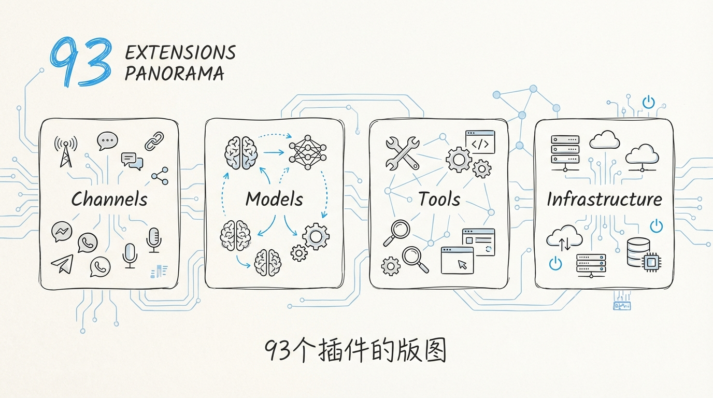
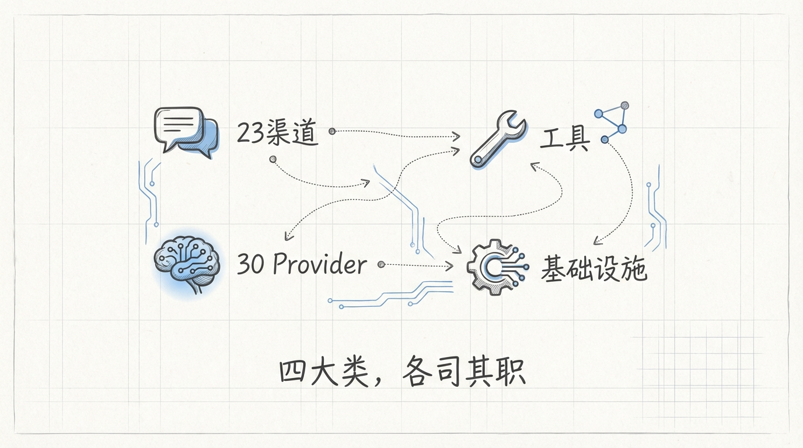
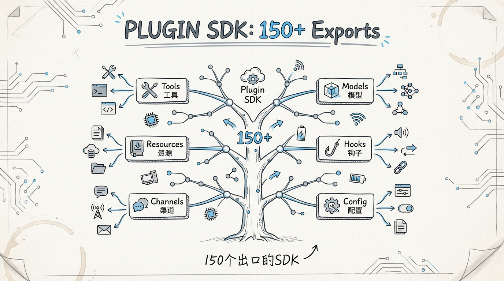
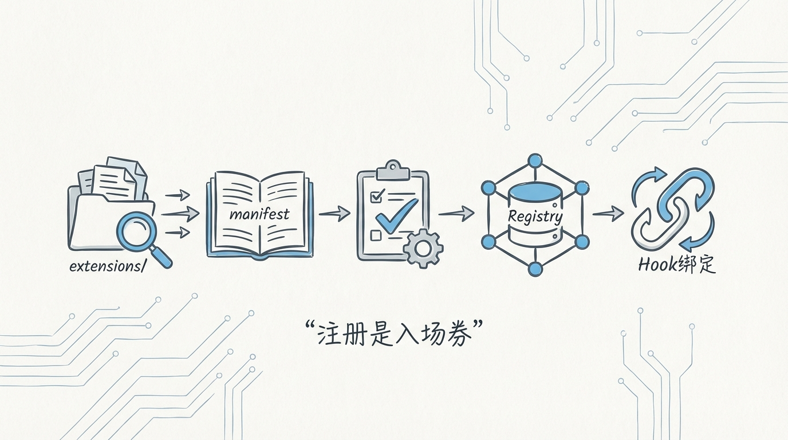

[English](docs/04-Extensions-Plugin-System.md)

# 04 Extensions 插件体系：93 个插件的发现、加载与生命周期



93 个插件。不是 9 个，不是 30 个，是 **93 个独立的 npm 包**，每个都有自己的 `package.json`、`openclaw.plugin.json`、入口文件和运行时。

你可能会问：一个个人 AI 助手项目，为什么需要 93 个插件？

答案藏在 `extensions/` 目录里。这 93 个插件覆盖了 **23+ 消息渠道、30+ LLM Provider、一整套基础设施**。从 Telegram 到 Zalo，从 Anthropic 到混元，从语音合成到图片生成，从 LanceDB 向量存储到 OpenTelemetry 诊断。Peter Steinberger 把一个 AI 助手能碰到的所有外部依赖，全部封装成了可插拔的模块。

**这不是插件化做过头了，这是 93 个第三方 API 各有各的坑，必须隔离。**

---

## 1️⃣ 插件分类：四大类 93 个



`extensions/` 目录下的 93 个插件按功能分成四大类：

```
extensions/
├── 🔌 Channels（消息渠道）── 23+ 个
│   ├── discord/           WhatsApp        telegram/
│   ├── slack/             signal/         imessage/
│   ├── msteams/           matrix/         line/
│   ├── feishu/            googlechat/     irc/
│   ├── nostr/             mattermost/     nextcloud-talk/
│   ├── twitch/            synology-chat/  bluebubbles/
│   ├── zalo/              zalouser/       tlon/
│   └── whatsapp/
│
├── 🧠 Models（LLM Provider）── 30+ 个
│   ├── anthropic/         openai/         google/
│   ├── anthropic-vertex/  amazon-bedrock/ groq/
│   ├── mistral/           deepseek/       moonshot/
│   ├── ollama/            openrouter/     together/
│   ├── xai/               nvidia/         huggingface/
│   ├── minimax/           qianfan/        volcengine/
│   ├── byteplus/          modelstudio/    kimi-coding/
│   ├── litellm/           vllm/           sglang/
│   ├── venice/            chutes/         lobster/
│   ├── kilocode/          zai/            copilot-proxy/
│   ├── github-copilot/    perplexity/
│   ├── cloudflare-ai-gateway/             vercel-ai-gateway/
│   └── microsoft-foundry/
│
├── 🔧 Tools & Capabilities ── 15+ 个
│   ├── browser/           brave/          duckduckgo/
│   ├── exa/               tavily/         firecrawl/
│   ├── elevenlabs/        deepgram/       fal/
│   ├── speech-core/       image-generation-core/
│   ├── media-understanding-core/
│   ├── open-prose/        openshell/      phone-control/
│   └── diffs/
│
└── 🏗️ Infrastructure ── 10+ 个
    ├── memory-core/       memory-lancedb/
    ├── device-pair/       diagnostics-otel/
    ├── thread-ownership/  llm-task/
    ├── talk-voice/        voice-call/
    ├── shared/            test-utils/
    ├── acpx/              synthetic/
    ├── google-gemini-cli-auth/
    ├── minimax-portal-auth/
    └── qwen-portal-auth/
```

---

## 2️⃣ Plugin SDK：150+ 子路径导出的 API 表面



每个插件都通过 `openclaw/plugin-sdk/core` 引用宿主提供的 API。这个 SDK 不是一个单一入口，而是通过 `package.json` 的 `exports` 字段暴露了 **150+ 个子路径**。

```
openclaw (package.json exports)
├── plugin-sdk/core            ← 核心类型 + defineChannelPluginEntry()
├── plugin-sdk/telegram        ← Telegram 专用 API
├── plugin-sdk/signal          ← Signal 专用 API
├── plugin-sdk/ollama          ← Ollama 兼容层
├── config/config              ← OpenClawConfig 类型
├── config/types               ← 配置子类型
├── channels/plugins/types     ← ChannelPlugin 接口
├── plugins/types              ← PluginDefinition 接口
├── plugins/hooks              ← Hook Runner API
├── plugins/manifest           ← Manifest 解析
├── plugins/discovery          ← 插件发现
├── plugins/loader             ← 插件加载
├── ...                        ← 150+ 个子路径
```

这种设计的好处是 **tree-shaking 友好**。一个只做 Telegram 渠道适配的插件，不需要引入 OpenAI 的类型定义。每个子路径是一个独立的模块边界。

插件入口的标准写法：

```typescript
// extensions/discord/index.ts

import { defineChannelPluginEntry } from "openclaw/plugin-sdk/core";
import { discordPlugin } from "./src/channel.js";
import { setDiscordRuntime } from "./src/runtime.js";
import { registerDiscordSubagentHooks } from "./src/subagent-hooks.js";

export default defineChannelPluginEntry({
  id: "discord",
  name: "Discord",
  description: "Discord channel plugin",
  plugin: discordPlugin,
  setRuntime: setDiscordRuntime,
  registerFull: registerDiscordSubagentHooks,
});
```

`defineChannelPluginEntry()` 是一个类型安全的工厂函数。它强制每个 Channel 插件必须提供 `id`、`plugin`、`setRuntime` 三个字段，`registerFull` 是可选的全量注册回调，用于需要 Subagent Hook 的复杂场景。

---

## 3️⃣ openclaw.plugin.json：Manifest 的元数据契约

```json
// extensions/discord/openclaw.plugin.json
{
  "id": "discord",
  "channels": ["discord"],
  "configSchema": {
    "type": "object",
    "additionalProperties": false,
    "properties": {}
  }
}
```

每个插件根目录下都有一个 `openclaw.plugin.json`，这是插件的 **身份证**。宿主在不加载插件代码的情况下，就能通过 manifest 知道：

```typescript
// src/plugins/manifest.ts

export type PluginManifest = {
  id: string;
  configSchema: Record<string, unknown>;       // JSON Schema 配置验证
  enabledByDefault?: boolean;                   // 是否默认启用
  legacyPluginIds?: string[];                   // 历史 ID 映射
  autoEnableWhenConfiguredProviders?: string[];  // 自动启用触发条件
  kind?: PluginKind;                            // 插件类型
  channels?: string[];                          // 声明的渠道
  providers?: string[];                         // 声明的 Provider
  cliBackends?: string[];                       // CLI 推理后端
  providerAuthEnvVars?: Record<string, string[]>; // 认证环境变量
  providerAuthChoices?: PluginManifestProviderAuthChoice[];
  skills?: string[];                            // 技能声明
  contracts?: PluginManifestContracts;          // 能力契约
  channelConfigs?: Record<string, PluginManifestChannelConfig>;
};
```

`contracts` 字段是 **静态能力声明**。一个插件可以声明自己提供 speechProviders、webSearchProviders、imageGenerationProviders 等能力，宿主在运行时可以根据这些声明做 **能力路由**，不需要加载每个插件再问它支持什么。

`providerAuthEnvVars` 也是懒加载的关键。宿主可以通过这个字段知道 `OPENAI_API_KEY` 对应的是 `openai` 插件，`ANTHROPIC_API_KEY` 对应 `anthropic` 插件，完全不需要 import 插件代码。

---

## 4️⃣ 插件生命周期：从发现到销毁的五个阶段


```
┌──────────┐    ┌──────────┐    ┌──────────────────┐    ┌──────────┐    ┌──────────┐
│ Discovery│───▶│   Init   │───▶│ Hook Registration│───▶│ Runtime  │───▶│ Teardown │
│  发现     │    │  初始化   │    │  Hook 注册        │    │  运行时   │    │  销毁     │
└──────────┘    └──────────┘    └──────────────────┘    └──────────┘    └──────────┘
     │               │                  │                    │               │
     ▼               ▼                  ▼                    ▼               ▼
  扫描目录        加载模块           注册 Hooks           处理请求        清理资源
  解析 manifest   验证配置           绑定事件             执行逻辑        释放连接
  安全检查        创建 Runtime       能力注册             状态更新        移除注册
```

**阶段 1：Discovery（发现）**

`discoverOpenClawPlugins()` 负责扫描三个来源的插件：

```typescript
// src/plugins/discovery.ts

export type PluginCandidate = {
  idHint: string;           // 插件 ID 提示
  source: string;           // 入口文件路径
  setupSource?: string;     // Setup 入口（可选）
  rootDir: string;          // 插件根目录
  origin: PluginOrigin;     // 来源标识
  format?: PluginFormat;    // 格式（ts/js/bundle）
  bundleFormat?: PluginBundleFormat;
  packageName?: string;     // npm 包名
  packageManifest?: OpenClawPackageManifest;
  bundledManifest?: PluginManifest;
};
```

三个发现来源：
1. **Stock 内置插件** — `extensions/` 目录下的 93 个
2. **Global 全局插件** — 用户 home 目录下安装的
3. **Workspace 工作区插件** — 当前项目目录下的

Discovery 阶段有 **安全检查**。`CandidateBlockReason` 枚举列出了四种拒绝原因：路径逃逸、stat 失败、world-writable 权限、可疑的文件所有权。插件沙箱从发现阶段就开始了。

**阶段 2：Init（初始化）**

```typescript
// src/plugins/loader.ts

export type PluginLoadOptions = {
  config?: OpenClawConfig;
  workspaceDir?: string;
  logger?: PluginLogger;
  runtimeOptions?: CreatePluginRuntimeOptions;
  cache?: boolean;              // 是否使用注册表缓存
  mode?: "full" | "validate";   // 完整加载 or 仅验证
  onlyPluginIds?: string[];     // 白名单过滤
  activate?: boolean;           // 是否立即激活
  throwOnLoadError?: boolean;   // 加载错误是否抛异常
};
```

`loadOpenClawPlugins()` 使用 **jiti**（JIT TypeScript Importer）动态加载 TypeScript 源文件，不需要编译步骤。每个插件的配置通过 `configSchema`（JSON Schema）验证，不合法的配置直接拦截。

加载器内置了 **128 条注册表缓存**。相同 workspace + 相同插件配置的组合，不会重复加载。这对频繁创建 session 的场景至关重要。

**阶段 3：Hook Registration（Hook 注册）**

插件通过 Hook 系统与宿主通信。宿主提供 20+ 个 Hook 点位：

| Hook 名称 | 触发时机 | 返回值影响 |
|-----------|---------|-----------|
| `before_agent_start` | Agent 开始运行前 | 可修改 Provider/Model |
| `before_tool_call` | 工具调用前 | 可拦截/修改参数 |
| `after_tool_call` | 工具调用后 | 可修改结果 |
| `before_dispatch` | 消息分发前 | 可重路由/拦截 |
| `before_compaction` | 上下文压缩前 | 可取消压缩 |
| `after_compaction` | 压缩完成后 | 通知（无拦截） |
| `before_model_resolve` | 模型解析前 | 可覆盖模型选择 |
| `before_prompt_build` | Prompt 构建前 | 可注入内容 |
| `message_received` | 收到消息时 | 通知 |
| `message_sending` | 发送消息前 | 可修改内容 |
| `message_sent` | 发送完成后 | 通知 |
| `session_start` | Session 创建时 | 通知 |
| `session_end` | Session 结束时 | 通知 |
| `inbound_claim` | 入站消息认领 | 可抢占消息处理权 |
| `llm_input` | LLM 请求发出前 | 通知（审计用） |
| `llm_output` | LLM 响应收到后 | 通知（审计用） |
| `subagent_spawning` | 子 Agent 创建前 | 可修改参数 |
| `subagent_spawned` | 子 Agent 创建后 | 通知 |
| `subagent_ended` | 子 Agent 结束 | 通知 |
| `gateway_start` | Gateway 启动 | 通知 |
| `gateway_stop` | Gateway 停止 | 通知 |
| `before_reset` | Session 重置前 | 通知 |
| `tool_result_persist` | 工具结果持久化前 | 可修改持久化行为 |
| `before_message_write` | 消息写入前 | 可修改写入内容 |

```typescript
// src/plugins/hooks.ts

export type HookRunnerOptions = {
  logger?: HookRunnerLogger;
  catchErrors?: boolean;   // 错误是捕获还是抛出
};
```

Hook Runner 的 `catchErrors` 选项很关键。在生产环境中设为 `true`，单个插件的 hook 报错不会打断整个请求流程。**一个有 bug 的 Telegram 插件不应该让 Discord 用户的消息发不出去。**

**阶段 4：Runtime（运行时）**

```typescript
// src/plugins/runtime.ts

const REGISTRY_STATE = Symbol.for("openclaw.pluginRegistryState");

type RegistryState = {
  activeRegistry: PluginRegistry | null;
  activeVersion: number;
  httpRoute: RegistrySurfaceState;   // HTTP 路由专用注册表视图
  channel: RegistrySurfaceState;     // Channel 专用注册表视图
  key: string | null;
};
```

运行时通过 `Symbol.for()` 在全局状态中维护一个单例注册表。`httpRoute` 和 `channel` 是两个独立的 **Surface State**，可以被分别 pin 住。这允许 HTTP 路由层和 Channel 层使用不同版本的插件注册表，实现 **无感热更新**。

**阶段 5：Teardown（销毁）**

插件卸载时，注册表版本号递增，所有引用旧版本的调用方会在下次访问时自动切换到新版本。没有显式的 destroy 回调，靠 **版本号驱动的惰性切换** 实现优雅退出。

---

## 5️⃣ 插件注册表：全局单例的版本化管理



```typescript
// src/plugins/runtime.ts

export function setActivePluginRegistry(registry: PluginRegistry, cacheKey?: string) {
  state.activeRegistry = registry;
  state.activeVersion += 1;
  syncTrackedSurface(state.httpRoute, registry, true);
  syncTrackedSurface(state.channel, registry, true);
  state.key = cacheKey ?? null;
}
```

每次调用 `setActivePluginRegistry()`，版本号 +1，HTTP 和 Channel 两个 Surface 同步刷新。如果某个 Surface 被 pin 住了（`pinned: true`），刷新会被跳过。

**Pin 机制的应用场景：** Gateway 在处理一个长连接请求时，可以 pin 住当前的 HTTP 路由注册表，保证整个请求的生命周期内插件不会被热替换。请求结束后 release，下一个请求自然用最新版本。

---

## 6️⃣ 插件发现的缓存策略

```typescript
// src/plugins/discovery.ts

const discoveryCache = new Map<string, { expiresAt: number; result: PluginDiscoveryResult }>();
const DEFAULT_DISCOVERY_CACHE_MS = 1000;  // 1 秒缓存
```

1 秒的缓存窗口。这个数字看起来很短，但它解决的是 **启动风暴** 问题。Gateway 启动时会有多个子系统几乎同时触发插件发现，1 秒的缓存让它们共享同一次扫描结果。

缓存 key 的生成很讲究：workspace 路径 + 文件所有者 UID + 全局配置路径 + 内置插件路径 + 额外加载路径。任何一个维度变了，缓存失效。

---

## 7️⃣ Plugin SDK Alias 解析

插件引用 `openclaw/plugin-sdk/core` 时，实际的模块路径需要经过一层 **alias 解析**：

```typescript
// src/plugins/sdk-alias.ts

export type PluginSdkResolutionPreference =
  | "native-jiti"      // 原生 jiti 解析
  | "alias-map"        // 别名映射表
  | "auto";            // 自动选择
```

两种解析策略：

1. **Native Jiti** — 让 jiti 直接解析 TypeScript 源码中的 import 路径，零配置但可能慢
2. **Alias Map** — 预计算一张 `openclaw/*` → 实际文件路径的映射表，查表即用

`auto` 模式下，系统会检测当前环境。打包后的产物用 Alias Map（因为 jiti 找不到源码），开发环境用 Native Jiti（因为源码就在那里）。

---

## 8️⃣ 配置验证：JSON Schema 的运行时守卫

```typescript
// src/plugins/schema-validator.ts — 配置验证
// src/plugins/config-schema.ts — Schema 定义
// src/plugins/config-state.ts — 状态管理

function resolveEffectiveEnableState(params: {
  pluginId: string;
  manifest?: PluginManifest;
  config?: NormalizedPluginsConfig;
}): boolean
```

每个插件的 `configSchema` 字段是一个 JSON Schema。用户在 `openclaw.config.json` 里写的插件配置，会在加载阶段通过 `validateJsonSchemaValue()` 验证。**配置不合法 → 插件不加载。** 不是运行时报错，是直接拦截在初始化阶段。

`resolveEffectiveEnableState()` 的决策链：用户显式配置 > manifest 的 `enabledByDefault` > 基于 `autoEnableWhenConfiguredProviders` 的自动启用。三层优先级，覆盖关系清晰。

---

## 9️⃣ Memory 插件的特殊路径


`memory-core` 和 `memory-lancedb` 两个插件走了一条 **特殊的加载路径**。因为 Memory 系统需要在插件加载完成后立即注册 embedding provider 和 flush plan resolver，这些注册信息需要在插件注册表缓存时一并保存和恢复。

```typescript
// src/plugins/loader.ts

type CachedPluginState = {
  registry: PluginRegistry;
  memoryEmbeddingProviders: ReturnType<typeof listRegisteredMemoryEmbeddingProviders>;
  memoryFlushPlanResolver: ReturnType<typeof getMemoryFlushPlanResolver>;
  memoryPromptBuilder: ReturnType<typeof getMemoryPromptSectionBuilder>;
  memoryRuntime: ReturnType<typeof getMemoryRuntime>;
};
```

四个 Memory 相关的状态跟插件注册表 **绑定缓存**。注册表恢复时，Memory 状态一并恢复，不需要重新初始化。这是因为 Memory 的初始化涉及 LanceDB 连接建立，代价不低。

---

## 🔟 插件隔离与错误边界

```typescript
// src/plugins/loader.ts

export class PluginLoadFailureError extends Error {
  readonly pluginIds: string[];
  readonly registry: PluginRegistry;

  constructor(registry: PluginRegistry) {
    const failedPlugins = registry.plugins.filter((entry) => entry.status === "error");
    const summary = failedPlugins
      .map((entry) => `${entry.id}: ${entry.error ?? "unknown plugin load error"}`)
      .join("; ");
    super(`plugin load failed: ${summary}`);
    this.pluginIds = failedPlugins.map((entry) => entry.id);
    this.registry = registry;
  }
}
```

`PluginLoadFailureError` 把所有失败插件的 ID 和错误信息打包在一起，但 **registry 本身仍然是可用的**。失败的插件被标记为 `status: "error"`，其他正常加载的插件照常运行。

**这是整个插件系统最重要的设计决策。** 93 个插件，任何一个有 bug 都不应该拖垮整个系统。Moonshot 的 SDK 突然不兼容了？标记错误，其他 92 个继续工作。Telegram 的 API 改了？Telegram 插件挂了，Discord 用户完全无感。

一个没有错误隔离的插件系统，跟没有插件系统一样脆弱。

---

下一篇：[05 多渠道消息系统：23+ 平台的统一接入](05-多渠道消息系统.md)
