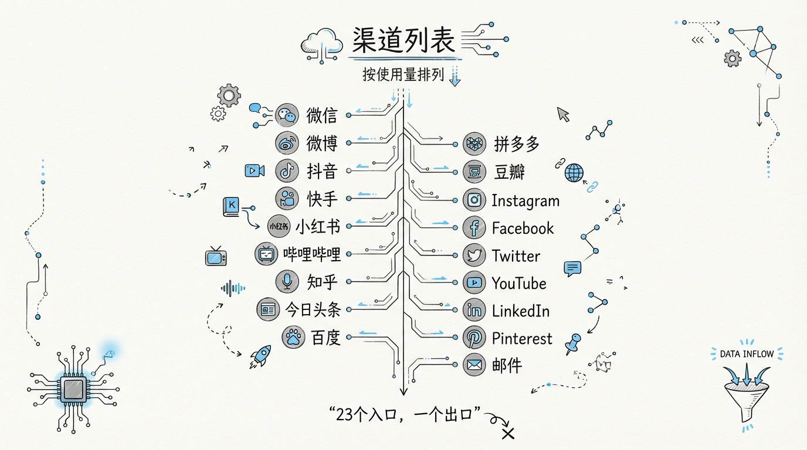
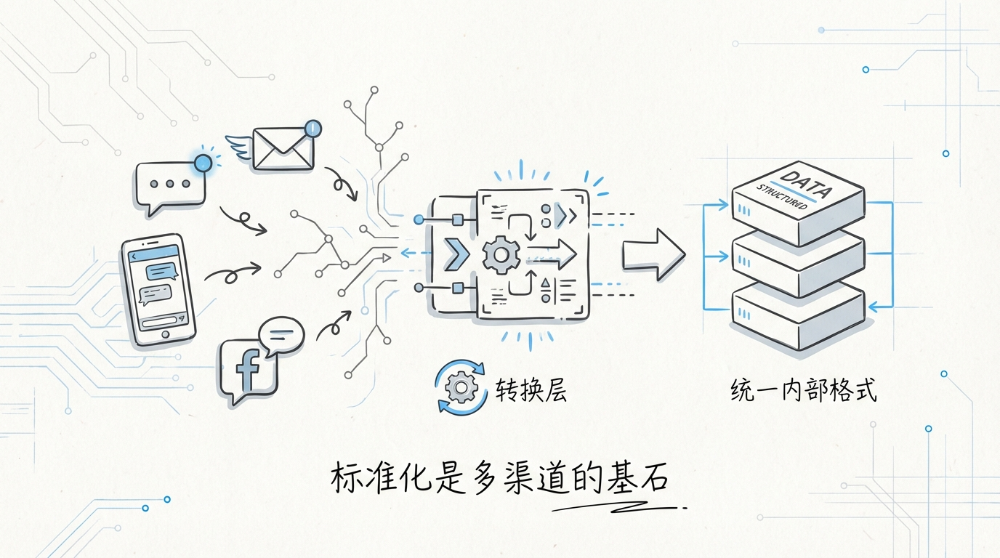
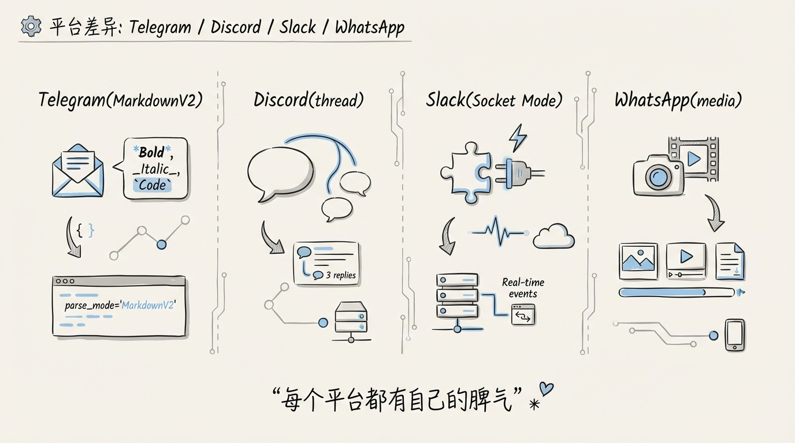
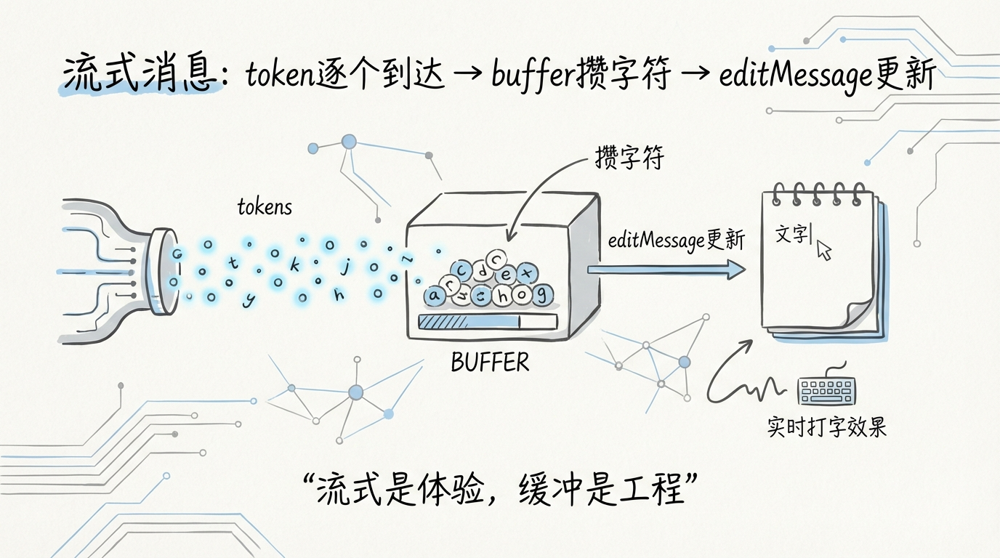
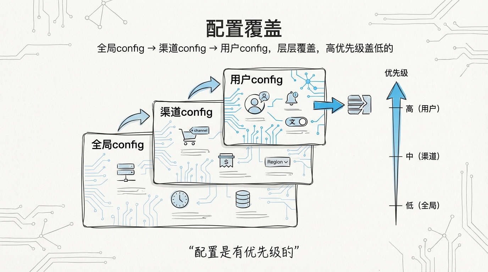

[English](docs/05-Multi-Channel-Messaging.md)

# 05 多渠道消息系统：23+ 平台的统一接入


WhatsApp、Telegram、Discord、Slack、Signal、iMessage、飞书、Matrix、IRC、Nostr、Line、Twitch、Microsoft Teams、Google Chat、Zalo、Synology Chat、Mattermost、Nextcloud Talk、BlueBubbles、Tlon……

**23 个平台，23 套 API，23 种消息格式，23 组鉴权方式。** 如果你曾经对接过两个以上的消息平台，你就知道这有多疯狂。Telegram 的 Markdown 是魔改版 MarkdownV2，Discord 有自动 thread 创建，Slack 用 Socket Mode 长连接，WhatsApp 需要 Business API 认证，iMessage 要走 BlueBubbles 桥接……

OpenClaw 把这 23+ 个平台统一到了一套消息管道里。**同一条 System Prompt，同一个 Agent，同时在 Telegram 和 Discord 上活着，各自遵守各自平台的规矩。** 这背后是一套精心设计的渠道抽象层。

---

## 1️⃣ 23+ 渠道全景一览



| 分类 | 渠道 | 核心协议 | 特殊能力 |
|------|------|---------|---------|
| **即时通讯** | WhatsApp | Business API / Cloud API | 端到端加密、Group 管理 |
| | Telegram | Bot API / MTProto | MarkdownV2、Inline Buttons、Reactions |
| | Signal | signal-cli | 端到端加密、Reaction |
| | iMessage | BlueBubbles Bridge | Apple 生态专属 |
| | Line | Messaging API | Rich Menu、Flex Message |
| | Zalo / ZaloUser | Zalo OA API | 越南市场专属 |
| **团队协作** | Discord | Gateway + REST | Auto-thread、Slash Commands、Embeds |
| | Slack | Socket Mode + Web API | Thread Reply、App Mentions、Blocks |
| | MS Teams | Bot Framework | Adaptive Cards、Teams Channel |
| | 飞书 / Feishu | Open API | 卡片消息、事件订阅 |
| | Google Chat | Chat API | Spaces、Cards v2 |
| | Mattermost | WebSocket + REST | 自托管、Plugin API |
| | Nextcloud Talk | Spreed API | 自托管协作 |
| **开放协议** | Matrix | Matrix Client-Server | 联邦制、端到端加密 |
| | IRC | IRC Protocol | 古典互联网 |
| | Nostr | NIP-01 WebSocket | 去中心化 |
| | Tlon | Tlon API | Urbit 生态 |
| **流媒体** | Twitch | IRC + EventSub | 直播弹幕互动 |
| **设备直连** | Synology Chat | WebHook | NAS 内网 |
| | BlueBubbles | REST + WebSocket | macOS 桥接 |

每个渠道都是一个独立的 Extension 插件，遵循上一篇讲的 `defineChannelPluginEntry()` 接口。

---

## 2️⃣ Channel Plugin 接口：统一抽象层

```
┌─────────────────────────────────────────────────────┐
│              ChannelPlugin 接口规范                    │
│                                                     │
│  ┌──────────────────┐  ┌──────────────────────────┐ │
│  │ ChannelConfigAdapter│  │ 负责：                  │ │
│  │                    │  │ · 解析平台配置           │ │
│  │                    │  │ · 校验凭据              │ │
│  │                    │  │ · 生成 Session Key      │ │
│  └──────────────────┘  └──────────────────────────┘ │
│                                                     │
│  ┌──────────────────┐  ┌──────────────────────────┐ │
│  │ ChannelGroupAdapter│  │ 负责：                  │ │
│  │                    │  │ · 群组消息路由           │ │
│  │                    │  │ · @提及检测             │ │
│  │                    │  │ · 群工具策略             │ │
│  └──────────────────┘  └──────────────────────────┘ │
│                                                     │
│  ┌──────────────────┐  ┌──────────────────────────┐ │
│  │ ChannelMentionAdapter│ │ 负责：                 │ │
│  │                    │  │ · 识别 @bot 消息        │ │
│  │                    │  │ · 群组 require-mention  │ │
│  └──────────────────┘  └──────────────────────────┘ │
│                                                     │
│  ┌──────────────────┐  ┌──────────────────────────┐ │
│  │ChannelThreadingAdapter││ 负责：                 │ │
│  │                    │  │ · Thread/Topic 管理     │ │
│  │                    │  │ · Thread ID 绑定        │ │
│  └──────────────────┘  └──────────────────────────┘ │
│                                                     │
│  ┌──────────────────┐  ┌──────────────────────────┐ │
│  │ChannelCommandAdapter│ │ 负责：                  │ │
│  │                    │  │ · 平台原生命令注册       │ │
│  │                    │  │ · Slash Commands        │ │
│  └──────────────────┘  └──────────────────────────┘ │
│                                                     │
│  ┌──────────────────┐  ┌──────────────────────────┐ │
│  │ChannelElevatedAdapter││ 负责：                  │ │
│  │                    │  │ · 权限提升操作           │ │
│  │                    │  │ · Owner-only 功能       │ │
│  └──────────────────┘  └──────────────────────────┘ │
└─────────────────────────────────────────────────────┘
```

`ChannelPlugin` 不是一个大而全的接口，而是 **6 个小 Adapter 的组合**。每个平台按需实现。IRC 不需要 ThreadingAdapter，Telegram 不需要 ElevatedAdapter。只实现你需要的。

---

## 3️⃣ 消息标准化：从平台原生格式到统一内部格式



每个平台的消息格式天差地别。Telegram 发过来的是 `Update` 对象带 `message.text` + `message.entities`，Discord 发过来的是 `Message` 对象带 `content` + `embeds`，WhatsApp 发过来的是 Webhook payload 带 `messages[0].text.body`。

标准化管线的工作是把这些格式统一成内部的 `MsgContext`：

```
┌────────────┐    ┌─────────────────┐    ┌──────────────┐
│ Telegram   │    │                 │    │              │
│ Update     │───▶│                 │    │              │
│ .message   │    │  Channel Plugin │    │  MsgContext   │
├────────────┤    │  .normalize()   │───▶│              │
│ Discord    │    │                 │    │  .text       │
│ Message    │───▶│  统一入口        │    │  .senderId   │
│ .content   │    │                 │    │  .channel    │
├────────────┤    │                 │    │  .threadId   │
│ Slack      │    │                 │    │  .media[]    │
│ Event      │───▶│                 │    │  .metadata   │
│ .blocks    │    │                 │    │              │
└────────────┘    └─────────────────┘    └──────────────┘
```

Session Key 的生成规则也是标准化的一部分：

```
agent:{agentId}:{channel}:{kind}:{userId}
│                │         │      │
│                │         │      └── 用户唯一标识
│                │         └── dm / group / thread
│                └── telegram / discord / slack / ...
└── 固定前缀
```

`normalizeSessionStoreKey()` 对 key 做 trim + lowercase，保证 `TELEGRAM:DM:12345` 和 `telegram:dm:12345` 指向同一个 session。这种细节的防御性编码，在多渠道场景下能避免很多诡异的 session 分裂问题。

---

## 4️⃣ DM 策略与 Allow-From 认证

```typescript
// src/channels/allow-from.ts

export function isSenderIdAllowed(
  allow: { entries: string[]; hasWildcard: boolean; hasEntries: boolean },
  senderId: string | undefined,
  allowWhenEmpty: boolean,
): boolean {
  if (!allow.hasEntries) { return allowWhenEmpty; }
  if (allow.hasWildcard) { return true; }
  if (!senderId) { return false; }
  return allow.entries.includes(senderId);
}
```

OpenClaw 的 DM 安全模型有三层：

| 策略层 | 机制 | 配置方式 |
|--------|------|---------|
| **Pairing Code** | 设备配对码认证 | Gateway 层 |
| **allowFrom** | 白名单 Sender ID | 渠道配置 |
| **dmPolicy** | DM 行为策略 | `allowlist` / `open` |

`allowFrom` 支持 **通配符** 模式。设置 `"*"` 表示允许任何人发起 DM。`allowlist` 模式下，只有白名单内的用户可以跟 Agent 对话。

`mergeDmAllowFromSources()` 合并两个来源的白名单：静态配置里的 `allowFrom` 和运行时存储里的 `storeAllowFrom`。运行时存储允许用户通过命令动态添加白名单，不需要重启服务。

群组有独立的 `resolveGroupAllowFromSources()`，支持 `groupAllowFrom` 单独配置。**DM 和群组的安全策略是解耦的。** 你可以允许所有人在群里跟 Agent 互动，但只允许特定用户在私聊里使用。

---

## 5️⃣ 入站消息去抖：防止消息风暴

```typescript
// src/channels/inbound-debounce-policy.ts

export function shouldDebounceTextInbound(params: {
  text: string | null | undefined;
  cfg: OpenClawConfig;
  hasMedia?: boolean;
  commandOptions?: CommandNormalizeOptions;
  allowDebounce?: boolean;
}): boolean {
  if (params.allowDebounce === false) { return false; }
  if (params.hasMedia) { return false; }        // 带媒体的消息不去抖
  const text = params.text?.trim() ?? "";
  if (!text) { return false; }
  return !hasControlCommand(text, params.cfg);  // 命令消息不去抖
}
```

用户在 Telegram 里快速连发 5 条消息，每条都触发一次 LLM 调用？那是灾难。

去抖策略的核心逻辑：**只对纯文本消息去抖，带媒体的消息和命令消息直接放行。** 因为 `/reset` 这样的命令需要立即执行，图片消息可能是独立的任务。

`createChannelInboundDebouncer()` 为每个渠道创建独立的去抖器，去抖时间可以按渠道配置。Telegram 用户习惯分段发消息，去抖窗口可以设大一点；Discord 用户习惯一次发完，窗口可以小一些。

---

## 6️⃣ 各平台适配差异



### Telegram：MarkdownV2 + Inline Buttons + Reactions

Telegram 的 Markdown 解析器跟标准 Markdown 有一堆不兼容。`_` 表示斜体，`*` 表示加粗，但特殊字符必须用 `\` 转义。`.` `!` `(` `)` `{` `}` `+` `-` `=` `>` `#` 都要转义。

OpenClaw 的 Telegram 插件做了两件事：
1. **Reaction Guidance 注入** — 根据配置决定 Agent 是否应该积极使用 emoji 反应
2. **Inline Buttons 支持** — 在支持的场景下，Agent 的回复可以带交互按钮

```typescript
// Telegram 渠道能力解析（compact.ts 中引用）
const inlineButtonsScope = resolveTelegramInlineButtonsScope({
  cfg: params.config,
  accountId: params.agentAccountId ?? undefined,
});
if (inlineButtonsScope !== "off") {
  runtimeCapabilities.push("inlineButtons");
}
```

### Discord：Auto-Thread + Subagent Hooks

```typescript
// extensions/discord/index.ts
export default defineChannelPluginEntry({
  id: "discord",
  plugin: discordPlugin,
  setRuntime: setDiscordRuntime,
  registerFull: registerDiscordSubagentHooks,  // ← Discord 专属
});
```

Discord 是唯一一个注册了 `registerFull` 回调的渠道插件。因为 Discord 的 thread 创建需要跟 Subagent 系统联动：用户在一个 channel 里发消息，Agent 自动创建 thread 回复，thread 内的后续对话绑定到独立的 session。

### Slack：Socket Mode + Thread Reply

Slack 不用 Webhook，用的是 **Socket Mode** 长连接。这意味着 Slack 插件不需要公网入口，可以跑在内网 NAT 后面。

Thread Reply 的处理也不一样。Slack 的 thread 是 `thread_ts` 字段标识的，跟 Discord 的 thread channel 完全不同。`resolveSlackReplyToMode()` 负责决定 Agent 的回复应该在主 channel 还是 thread 里。

### Signal：端到端加密的挑战

Signal 通过 `signal-cli` 工具桥接。**所有消息在本地解密。** 这意味着 Signal 渠道的消息内容永远不会以明文经过第三方服务器。但代价是必须在运行 OpenClaw 的机器上安装 signal-cli 并完成注册。

`resolveSignalReactionLevel()` 控制 Agent 在 Signal 上的反应策略。因为 Signal 的 reaction 实现跟 Telegram 完全不同，需要单独的策略配置。

---

## 7️⃣ Typing Lifecycle：打字状态管理

```typescript
// src/channels/typing-lifecycle.ts

export function createTypingKeepaliveLoop(params: {
  intervalMs: number;
  onTick: AsyncTick;
}): TypingKeepaliveLoop
```

当 Agent 在处理一个需要 30 秒的复杂请求时，用户那边应该看到 **正在输入...** 的状态提示。但大多数平台的 typing indicator 只持续 5-10 秒。

`createTypingKeepaliveLoop()` 创建一个定时器，每隔 `intervalMs` 毫秒发送一次 typing 信号，保持打字状态直到回复完成。`tickInFlight` 标记防止并发：上一次 tick 还没完成，不会发起新的。

---

## 8️⃣ Draft Stream：流式消息的渐进渲染



LLM 的回复是流式的，一个 token 一个 token 吐出来。但你不能每收到一个 token 就发一条新消息。用户会收到 200 条通知。

`createFinalizableDraftStreamControls()` 实现了 **节流 + 编辑** 的策略：

```typescript
// src/channels/draft-stream-controls.ts

export function createFinalizableDraftStreamControls(params: {
  throttleMs: number;                     // 节流间隔
  isStopped: () => boolean;               // 是否已停止
  isFinal: () => boolean;                 // 是否已完成
  sendOrEditStreamMessage: (text: string) => Promise<boolean>;
})
```

工作原理：
1. 收到第一批 tokens → **发送新消息**
2. 后续 tokens 积攒到 `throttleMs` 间隔 → **编辑已发送的消息**
3. 流结束 → **最后一次 flush，标记为 final**

`stopForClear()` 处理一个边界情况：用户在 Agent 回复过程中发了 `/stop`，需要停止流式输出并清除正在编辑的消息。先标记 `stopped`，再等待 in-flight 的编辑请求完成，最后删除消息。**顺序不能反，否则会出现删了又被编辑覆盖的竞态。**

---

## 9️⃣ Run State Machine：渠道级别的并发控制

```typescript
// src/channels/run-state-machine.ts

export function createRunStateMachine(params: RunStateMachineParams) {
  let activeRuns = 0;

  return {
    onRunStart() {
      activeRuns += 1;
      publish();
      ensureHeartbeat();
    },
    onRunEnd() {
      activeRuns = Math.max(0, activeRuns - 1);
      if (activeRuns <= 0) { clearHeartbeat(); }
      publish();
    },
    deactivate,
  };
}
```

每个渠道维护自己的 Run State Machine，追踪当前有多少活跃的 Agent 运行。`activeRuns > 0` 时，渠道处于 **busy** 状态，心跳定时器启动。所有 run 结束后，心跳停止。

心跳的作用是 **定期向上游汇报活跃状态**。如果一个 run 卡住了（比如 LLM 超时），心跳仍然在跳，上游知道这个 Agent 还活着。如果心跳也停了，上游可以介入做健康检查。

`deactivate()` 在 AbortSignal 触发时调用，一键关停整个状态机。这保证了进程退出时不会有悬挂的定时器。

---

## 🔟 渠道配置的层级覆盖



渠道配置遵循一套 **三级覆盖** 规则：

```
全局默认值
  └── 渠道级配置（channels.telegram / channels.discord）
       └── 账号级配置（per-account overrides）
            └── DM/群组级配置
```

以 Telegram 的 `dmHistoryLimit` 为例：

```typescript
// src/agents/pi-embedded-runner/history.ts

export function getHistoryLimitFromSessionKey(
  sessionKey: string | undefined,
  config: OpenClawConfig | undefined,
): number | undefined
```

函数从 session key 中解析出 provider + kind + userId，然后按优先级查找：
1. 用户级 `dms.{userId}.historyLimit`
2. 渠道级 `channels.telegram.dmHistoryLimit`
3. 渠道级 `channels.telegram.historyLimit`

**群组和 DM 的配置是分开的。** 群组用 `historyLimit`，DM 用 `dmHistoryLimit`。群聊的历史通常比私聊更长，因为群聊里有多人上下文需要保持。

这套三级覆盖让运维人员可以做到极其精细的控制。某个 VIP 用户的 DM 历史保留 100 轮，普通用户 20 轮，群聊统一 50 轮。一份配置文件搞定，不需要改代码。

---

下一篇：[06 上下文管理：Token 预算、Compaction 与 Memory Flush](06-上下文管理.md)
