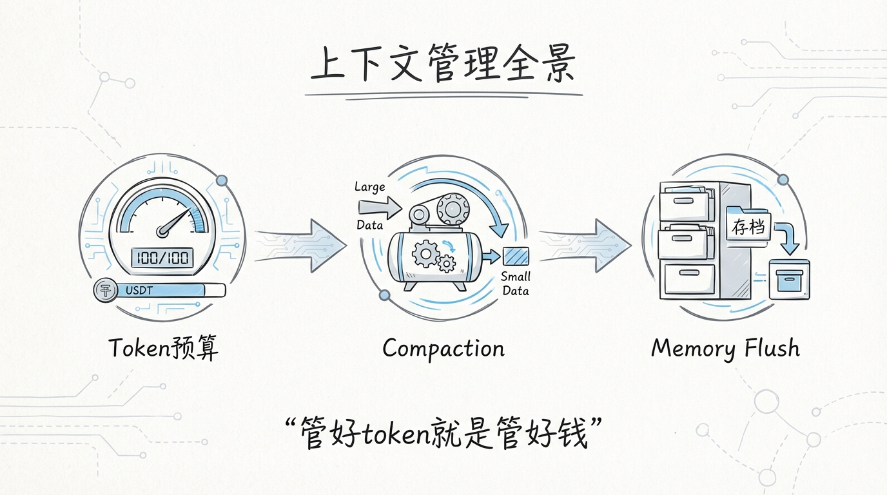
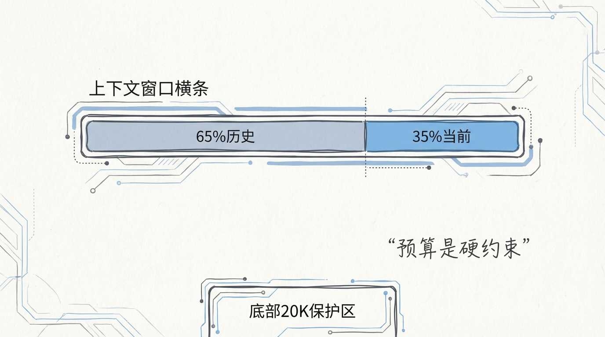
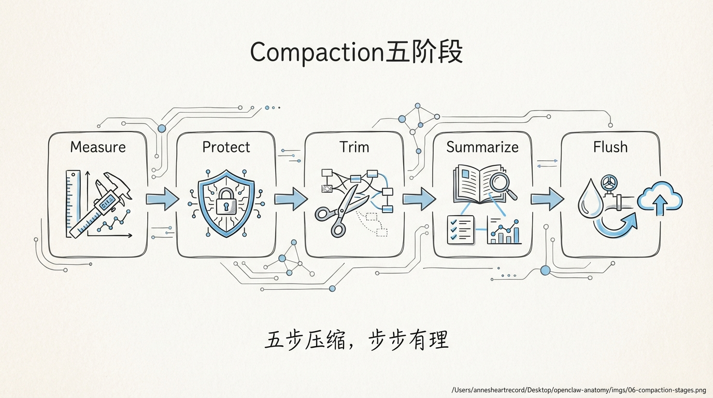
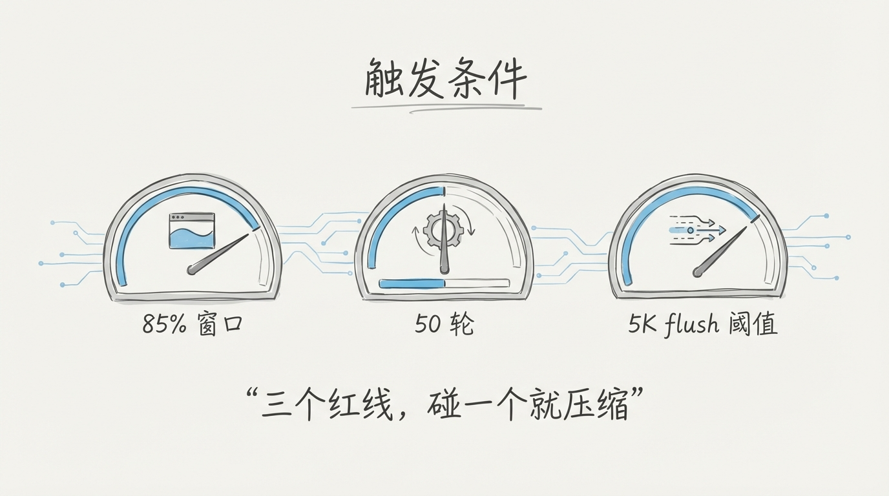
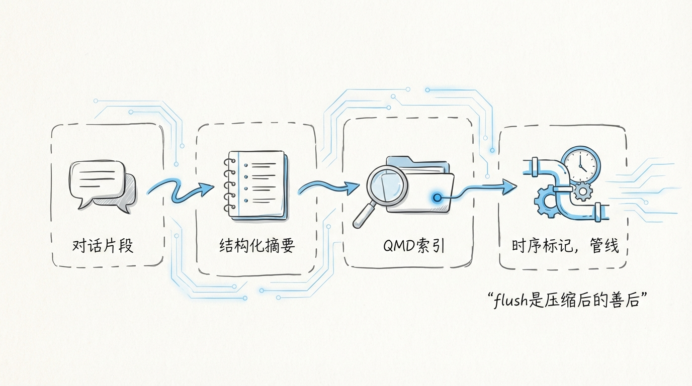
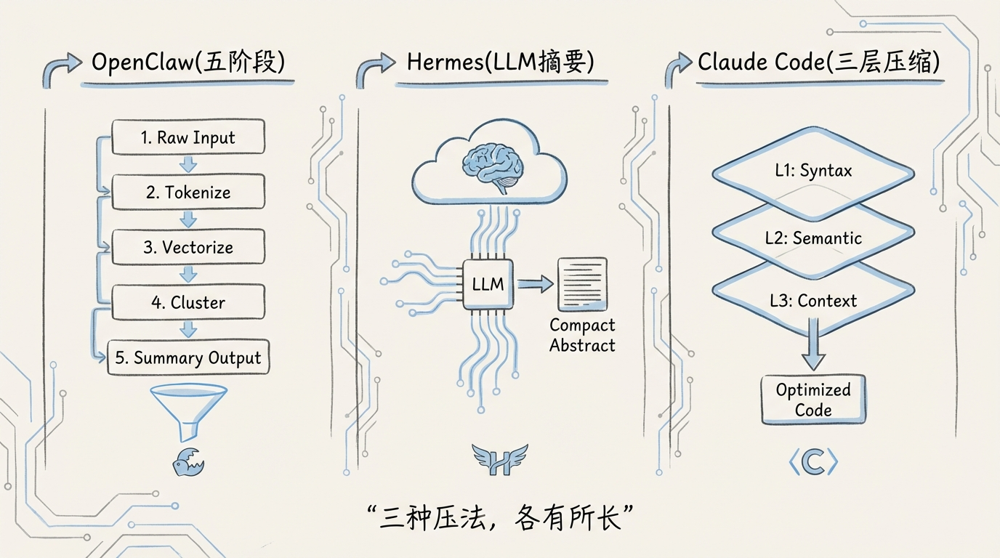
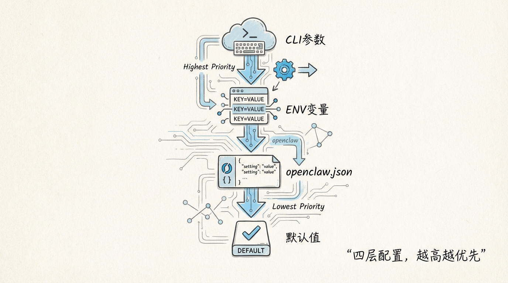

[English](docs/06-Context-Management.md)

# 06 上下文管理：Token 预算、Compaction 与 Memory Flush



LLM 的上下文窗口是一种 **稀缺资源**。Claude 的 200K、GPT-4o 的 128K、Gemini 的 1M，听起来很大，但一个长对话 + 几次大文件读取 + System Prompt + Bootstrap Context，窗口就塞满了。

OpenClaw 的上下文管理系统要在一个不断膨胀的对话历史和一个有限的 Token 预算之间，找到那条 **不丢关键信息又不炸窗口** 的线。这套系统的核心是 `compact.ts`，一个近千行的压缩引擎，配合 `history.ts` 的轮次裁剪、`tool-result-truncation.ts` 的大结果截断、`compaction-hooks.ts` 的 Memory Flush，形成一条完整的上下文生命周期管线。

**上下文管理不是一个功能，它是 Agent 能不能活过第 50 轮对话的生存问题。**

---

## 1️⃣ Token 预算管理：给上下文窗口画线



```typescript
// src/agents/context-window-guard.ts（由 compact.ts 引用）

const ctxInfo = resolveContextWindowInfo({
  cfg: params.config,
  provider,
  modelId,
  modelContextWindow: runtimeModel.contextWindow,
  defaultTokens: DEFAULT_CONTEXT_TOKENS,
});
```

Token 预算的计算不是拍脑袋定一个数字。`resolveContextWindowInfo()` 综合考虑四个因素：

```
┌────────────────────────────────────────────────────────┐
│                 Token 预算计算流程                       │
│                                                        │
│  模型原生窗口（contextWindow）                           │
│       │                                                │
│       ▼                                                │
│  配置覆盖（contextTokens）                              │
│       │   取 min(模型窗口, 配置值)                       │
│       ▼                                                │
│  预留地板（reserveTokensFloor）                          │
│       │   确保输出空间至少 N tokens                      │
│       ▼                                                │
│  最大历史占比（maxHistoryShare）                          │
│       │   历史消息不超过总预算的 X%                       │
│       ▼                                                │
│  有效预算 = min(模型窗口, 配置值) - 预留地板             │
│  历史预算 = 有效预算 × maxHistoryShare                   │
└────────────────────────────────────────────────────────┘
```

**为什么需要 reserveTokensFloor？** 因为如果历史消息把窗口全占了，模型就没有空间生成回复。预留地板保证模型至少有足够的 output tokens 来回答问题。

预算一旦确定，会被 **注入到 runtime model 对象里**：

```typescript
// compact.ts 中的关键代码

const effectiveModel = applyLocalNoAuthHeaderOverride(
  ctxInfo.tokens < (runtimeModel.contextWindow ?? Infinity)
    ? { ...runtimeModel, contextWindow: ctxInfo.tokens }
    : runtimeModel,
  apiKeyInfo,
);
```

这意味着 pi-coding-agent SDK 的自动 compaction 阈值，用的是 **经过配置覆盖后的有效限制**，而不是模型的原生窗口。你可以把一个 200K 窗口的 Claude 限制到 50K，强制更早触发压缩，节省费用。

---

## 2️⃣ Compaction 五阶段算法



`compactEmbeddedPiSessionDirect()` 是压缩的核心入口。整个过程分成五个阶段：

```
┌──────────┐   ┌──────────┐   ┌──────────┐   ┌──────────┐   ┌──────────┐
│ 1.Measure│──▶│ 2.Protect│──▶│ 3.Trim   │──▶│4.Summarize──▶│ 5.Flush  │
│  度量    │   │  保护    │   │  裁剪    │   │  摘要     │   │  刷写    │
└──────────┘   └──────────┘   └──────────┘   └──────────┘   └──────────┘
     │              │              │              │              │
     ▼              ▼              ▼              ▼              ▼
  统计消息数      识别不可       历史轮次       调用 LLM       文件截断
  估算 Tokens    压缩消息       裁剪          生成摘要       Memory 同步
  诊断日志       Hook 拦截     工具配对修复   替换历史       Session 归档
```

### 阶段 1：Measure（度量）

```typescript
// compact.ts

function summarizeCompactionMessages(messages: AgentMessage[]): CompactionMessageMetrics {
  let historyTextChars = 0;
  let toolResultChars = 0;
  const contributors: Array<{ role: string; chars: number; tool?: string }> = [];
  let estTokens = 0;

  for (const msg of messages) {
    const chars = getMessageTextChars(msg);
    historyTextChars += chars;
    if (role === "toolResult") { toolResultChars += chars; }
    contributors.push({ role, chars, tool: resolveMessageToolLabel(msg) });
    estTokens += estimateTokens(msg);
  }

  return {
    messages: messages.length,
    historyTextChars,
    toolResultChars,
    estTokens,
    contributors: contributors.toSorted((a, b) => b.chars - a.chars).slice(0, 3),
  };
}
```

度量阶段做三件事：统计消息总数、估算 Token 数量、找出 **占空间最多的 Top 3 消息**。Top 3 contributors 的信息会写入诊断日志，告诉你是哪个 tool result 或者哪条 assistant 回复吃掉了最多上下文。

**toolResultChars 单独统计** 有原因。如果 90% 的上下文都被 tool result 占了，更好的策略可能是截断 tool result 而不是做全量 compaction。

### 阶段 2：Protect（保护）

```typescript
if (!containsRealConversationMessages(session.messages)) {
  return { ok: true, compacted: false, reason: "no real conversation messages" };
}
```

保护阶段检查哪些消息 **不能被压缩**。`isRealConversationMessage()` 过滤掉系统注入的消息、tool setup 消息等非对话内容。如果 session 里全是非对话消息，直接返回 **不压缩**。

`runBeforeCompactionHooks()` 在这个阶段运行。**插件可以通过 before_compaction hook 阻止压缩。** 比如一个 Memory 插件正在做向量索引同步，它可以请求延迟压缩，避免正在被索引的消息被提前删除。

### 阶段 3：Trim（裁剪）

```typescript
// compact.ts 中的裁剪链

const validated = validateAnthropicTurns(validateGeminiTurns(prior));
const truncated = limitHistoryTurns(session.messages, dmHistoryLimit);
const limited = sanitizeToolUseResultPairing(truncated);
session.agent.replaceMessages(limited);
```

裁剪是压缩前的 **预处理**。三步清洗：

1. **Turn 验证** — `validateAnthropicTurns()` 确保消息序列符合 Anthropic 的 user/assistant 交替规则；`validateGeminiTurns()` 确保符合 Gemini 的约束
2. **轮次限制** — `limitHistoryTurns()` 按 DM 配置的 `historyLimit` 截掉最早的轮次
3. **配对修复** — `sanitizeToolUseResultPairing()` 修复被截断打断的 tool_use/tool_result 配对。如果 limitHistoryTurns 把包含 tool_use 的 assistant 消息删了，对应的 tool_result 会变成孤儿，必须也删掉

### 阶段 4：Summarize（摘要）

```typescript
const result = await compactWithSafetyTimeout(
  () => {
    setCompactionSafeguardCancelReason(compactionSessionManager, undefined);
    return session.compact(params.customInstructions);
  },
  compactionTimeoutMs,
  {
    abortSignal: params.abortSignal,
    onCancel: () => { session.abortCompaction(); },
  },
);
```

摘要阶段调用 LLM **生成对话历史的压缩摘要**。`session.compact()` 是 pi-coding-agent SDK 提供的方法，它把旧消息发给 LLM，让它生成一段总结，然后用这段总结替换被压缩的消息。

`compactWithSafetyTimeout()` 包了一层 **安全超时**：

```typescript
// compaction-safety-timeout.ts

export const EMBEDDED_COMPACTION_TIMEOUT_MS = 900_000;  // 15 分钟

export function resolveCompactionTimeoutMs(cfg?: OpenClawConfig): number {
  const raw = cfg?.agents?.defaults?.compaction?.timeoutSeconds;
  if (typeof raw === "number" && Number.isFinite(raw) && raw > 0) {
    return Math.min(Math.floor(raw) * 1000, MAX_SAFE_TIMEOUT_MS);
  }
  return EMBEDDED_COMPACTION_TIMEOUT_MS;
}
```

默认 15 分钟超时。超时后调用 `session.abortCompaction()` 强制取消。**压缩卡住比压缩失败更危险**，因为它会阻塞整个 session 的后续请求。

`customInstructions` 参数允许调用方传入额外的压缩指令。手动触发压缩时可以指定压缩重点，比如只保留代码相关的上下文，丢掉闲聊。

### 阶段 5：Flush（刷写）

```typescript
// compaction-hooks.ts

async function runPostCompactionSessionMemorySync(params: {
  config?: OpenClawConfig;
  sessionKey?: string;
  sessionFile: string;
}): Promise<void>
```

压缩完成后的刷写有两个子步骤：

**Session File 截断：**

```typescript
// session-truncation.ts

if (params.config?.agents?.defaults?.compaction?.truncateAfterCompaction) {
  const truncResult = await truncateSessionAfterCompaction({
    sessionFile: params.sessionFile,
  });
}
```

`truncateSessionAfterCompaction()` 解决的是 **文件无限增长** 问题。压缩后，被摘要的消息逻辑上已经不需要了，但 JSONL 文件里还保留着。多次压缩后，文件可能膨胀到几十 MB。截断操作 **物理删除** 已被摘要的 message entries，只保留：

1. Session header
2. 非 message 的状态条目（model_change、thinking_level_change 等）
3. 未被压缩的尾部消息
4. 压缩条目本身

**Memory Flush：**

```typescript
function syncPostCompactionSessionMemory(params: {
  mode: "off" | "async" | "await";
  // ...
}): Promise<void>
```

三种同步模式：
- `off` — 不同步，最快
- `async` — 异步同步，不阻塞后续请求
- `await` — 同步等待，保证 Memory 一致性

同步的目的是把被压缩的对话历史 **刷入 Memory 系统**（LanceDB 向量存储）。这样即使对话历史被压缩了，Agent 仍然可以通过 Memory 搜索回忆起之前的内容。

---

## 3️⃣ 触发条件：什么时候该压缩



Compaction 有三个触发路径：

| 触发方式 | 标识 | 条件 | 来源 |
|---------|------|------|------|
| **预算触发** | `trigger: "budget"` | Token 估算达到窗口的 ~85% | 主循环自动检测 |
| **溢出触发** | `trigger: "overflow"` | Provider 返回 context overflow 错误 | run.ts 错误分类 |
| **手动触发** | `trigger: "manual"` | 用户执行 /compact 命令 | 命令系统 |

**预算触发是最常见的。** 主循环在每次 attempt 前估算当前 session 的 token 量，如果接近窗口上限就主动压缩。这比等到 Provider 报 overflow 错误再压缩要好，因为预算触发可以 **从容地做摘要**，而溢出触发是在紧急状态下做抢救。

溢出触发有重试机制。`run.ts` 中的 `MAX_OVERFLOW_COMPACTION_ATTEMPTS = 3`，意味着连续溢出可以触发最多 3 次压缩重试。每次压缩后重新尝试 LLM 调用，如果还溢出就再压缩，直到成功或达到上限。

**Timeout 也会触发压缩，** 这是一个不太直觉的设计。如果 LLM 调用超时了，一个常见原因是 prompt 太长导致生成时间过长。`MAX_TIMEOUT_COMPACTION_ATTEMPTS = 2`，超时后先压缩再重试，可能解决问题。

---

## 4️⃣ Compaction 模型选择

```typescript
// compact.ts

const compactionModelOverride = params.config?.agents?.defaults?.compaction?.model?.trim();
let provider: string;
let modelId: string;
let authProfileId: string | undefined = params.authProfileId;

if (compactionModelOverride) {
  const slashIdx = compactionModelOverride.indexOf("/");
  if (slashIdx > 0) {
    provider = compactionModelOverride.slice(0, slashIdx).trim();
    modelId = compactionModelOverride.slice(slashIdx + 1).trim() || DEFAULT_MODEL;
    // Provider changed → drop primary auth profile
    if (provider !== (params.provider ?? "").trim()) {
      authProfileId = undefined;
    }
  }
}
```

压缩可以用 **跟主对话不同的模型**。主对话用 Claude Opus 保证质量，压缩用 Claude Haiku 节省成本。配置 `compaction.model: "anthropic/claude-3-5-haiku"` 就行。

关键细节：**Provider 切换时自动清除 Auth Profile。** 如果主对话用 OpenAI 的 Key，压缩切到 Anthropic，那 OpenAI 的 Key 发给 Anthropic 服务器就是认证错误。`authProfileId = undefined` 让系统回退到基于 Provider 的默认 Key 解析。

---

## 5️⃣ Stream Wrapper 的 Compaction 适配

压缩调用 LLM 时也需要经过 Stream Wrapper 层。`compact.ts` 在创建 session 时注册了和主循环相同的 Provider Stream：

```typescript
const providerStreamFn = registerProviderStreamForModel({
  model, cfg: params.config, agentDir, workspaceDir,
});
if (providerStreamFn) {
  session.agent.streamFn = providerStreamFn;
}
```

这保证了压缩调用也能享受到 Anthropic 的 Beta Header 注入、Google 的 ThinkingBudget 修复、Bedrock 的 Cache 禁用等所有适配。

---

## 6️⃣ 诊断系统：Compaction 的全程可观测

```
[compaction-diag] start runId=xxx diagId=cmp-xxxxx trigger=budget
  provider=anthropic/claude-3-5-sonnet attempt=1 maxAttempts=1
  pre.messages=47 pre.historyTextChars=123456
  pre.toolResultChars=89012 pre.estTokens=31000

[compaction-diag] contributors diagId=cmp-xxxxx
  top=[{"role":"toolResult","chars":45000,"tool":"bash"},
       {"role":"assistant","chars":23000},
       {"role":"toolResult","chars":15000,"tool":"read_file"}]

[compaction-diag] end diagId=cmp-xxxxx outcome=compacted
  durationMs=4523 post.messages=12 post.historyTextChars=8900
  delta.messages=-35 delta.estTokens=-24000
```

每次压缩都会生成一组 **结构化诊断日志**。`diagId` 是唯一标识，可以在日志系统里串联一次压缩的所有事件。`contributors` 告诉你哪些消息占了最多空间，这对优化 prompt 和工具使用策略极有价值。

`classifyCompactionReason()` 把失败原因归类成标准枚举：

```typescript
// compact-reasons.ts

export function classifyCompactionReason(reason?: string): string {
  const text = (reason ?? "").trim().toLowerCase();
  if (text.includes("nothing to compact")) return "no_compactable_entries";
  if (text.includes("below threshold")) return "below_threshold";
  if (text.includes("already compacted")) return "already_compacted_recently";
  if (text.includes("still exceeds target")) return "live_context_still_exceeds_target";
  if (text.includes("guard")) return "guard_blocked";
  if (text.includes("summary")) return "summary_failed";
  if (text.includes("timed out") || text.includes("timeout")) return "timeout";
  if (/[45]\d{2}/.test(text)) return text.includes("5") ? "provider_error_5xx" : "provider_error_4xx";
  return "unknown";
}
```

这些分类直接对接监控告警。`timeout` 和 `provider_error_5xx` 触发告警，`below_threshold` 和 `no_compactable_entries` 只记录不告警。

---

## 7️⃣ Memory Flush 到向量存储



压缩和 Memory 是 **协作关系**。压缩删掉了旧消息，Memory 把它们保存下来。

```typescript
// compaction-hooks.ts

function resolvePostCompactionIndexSyncMode(config?: OpenClawConfig): "off" | "async" | "await" {
  const mode = config?.agents?.defaults?.compaction?.postIndexSync;
  if (mode === "off" || mode === "async" || mode === "await") {
    return mode;
  }
  return "async";  // 默认异步
}
```

`postIndexSync` 默认是 `async`。这意味着压缩完成后，Memory 同步在后台进行，不阻塞用户的下一条消息。对话体验不受影响，代价是短暂的 **Memory 不一致窗口**。

Memory 搜索管理器通过 `getActiveMemorySearchManager()` 获取，搜索配置通过 `resolveMemorySearchConfig()` 解析。只有当配置中 `sources` 包含 `sessions` 且 `postCompactionForce` 为 true 时，才会触发同步。

---

## 8️⃣ Session File 的物理管理

Session 数据存储在 JSONL 文件里，每条消息一行 JSON。压缩后文件的物理管理：

```
Session JSONL 文件结构（压缩前）：
┌──────────────────────────────────────────┐
│ Line 1:  {"type":"header", ...}          │ ← 保留
│ Line 2:  {"type":"message", role:"user"} │ ← 被摘要，物理删除
│ Line 3:  {"type":"message", role:"asst"} │ ← 被摘要，物理删除
│ Line 4:  {"type":"message", role:"user"} │ ← 被摘要，物理删除
│ ...                                      │
│ Line 30: {"type":"compaction", ...}      │ ← 保留（摘要内容）
│ Line 31: {"type":"message", role:"user"} │ ← 保留（未被摘要）
│ Line 32: {"type":"message", role:"asst"} │ ← 保留
│ ...                                      │
└──────────────────────────────────────────┘

Session JSONL 文件结构（截断后）：
┌──────────────────────────────────────────┐
│ Line 1:  {"type":"header", ...}          │
│ Line 2:  {"type":"compaction", ...}      │ ← 摘要
│ Line 3:  {"type":"message", role:"user"} │ ← 未被摘要的尾部
│ Line 4:  {"type":"message", role:"asst"} │
│ ...                                      │
└──────────────────────────────────────────┘
```

`truncateSessionAfterCompaction()` 的实现需要处理一个微妙的问题：**分支**。Session 可能有多个分支（用户回退重试的场景），截断只能删除当前分支中被压缩的消息，不能动其他分支的数据。被删消息的子条目需要 **re-parent** 到最近的存活祖先。

---

## 9️⃣ 与 Hermes Agent / Claude Code 的压缩策略对比



| 维度 | OpenClaw | Hermes Agent | Claude Code |
|------|----------|-------------|-------------|
| **触发方式** | 预算/溢出/手动 三路触发 | 无内置压缩 | 自动触发 |
| **压缩算法** | 五阶段管线 + Hook 扩展 | N/A | SDK 内置压缩 |
| **摘要模型** | 可配置独立模型 | N/A | 与对话同模型 |
| **Memory 联动** | 压缩后 Flush 到向量存储 | 无 | 无 |
| **文件管理** | JSONL 物理截断 + 归档 | N/A | 自动管理 |
| **超时保护** | 15 分钟安全超时 + AbortSignal | N/A | 无显式超时 |
| **诊断能力** | 全程结构化日志 + diagId | N/A | 基础日志 |
| **多分支支持** | Session 分支感知截断 | 无分支 | 无分支 |
| **Hook 扩展** | before/after_compaction | 无 | 无 |
| **Tool Result 预处理** | 智能 head+tail 截断 | 无 | 基础截断 |

**Hermes Agent 根本没有压缩。** 它的设计哲学是保持对话短，不需要压缩。这在命令行工具的场景下可行，但在 24/7 运行的消息助手场景下不行。一个 Telegram 用户可能连续跟 Agent 聊几个小时，没有压缩就是等死。

**Claude Code 的压缩是 SDK 内置的黑盒。** 它不暴露 Hook 点，不支持配置独立的压缩模型，不做 Memory Flush。这对单用户 CLI 工具足够，但对多渠道多用户的平台来说，不够灵活。

OpenClaw 的五阶段管线是三者中 **最重的**，但也是最适合 **长期运行的多渠道 Agent** 的。每个阶段都有明确的职责和可观测性，出了问题从诊断日志就能定位。

---

## 🔟 配置速查

```yaml
# openclaw.config.yaml 中的上下文管理相关配置

agents:
  defaults:
    contextTokens: 100000          # 有效上下文预算
    compaction:
      model: "anthropic/claude-3-5-haiku"  # 压缩专用模型
      timeoutSeconds: 900          # 压缩超时（秒）
      truncateAfterCompaction: true # 压缩后物理截断文件
      postIndexSync: "async"       # Memory 同步模式

channels:
  telegram:
    dmHistoryLimit: 30             # DM 保留 30 轮
    historyLimit: 50               # 群聊保留 50 轮
  discord:
    dmHistoryLimit: 20
    historyLimit: 40
```



**这些数字没有放之四海而皆准的最优值。** Token 预算取决于你的使用场景和预算。压缩模型的选择取决于你愿意在压缩质量和速度之间做什么取舍。historyLimit 取决于你的用户是喜欢短对话还是马拉松式的长聊。

唯一确定的是：**不做上下文管理的 Agent，只能活在 demo 里。**

---

下一篇：[07 记忆系统与 MCP](07-记忆系统与MCP.md)
