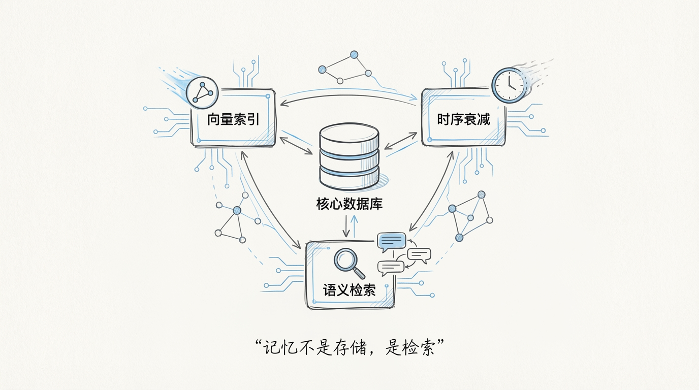
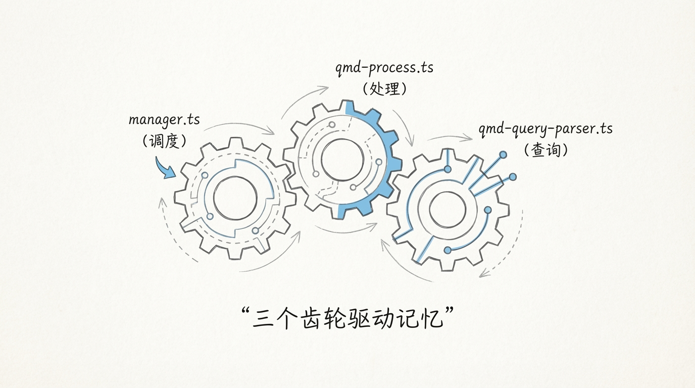
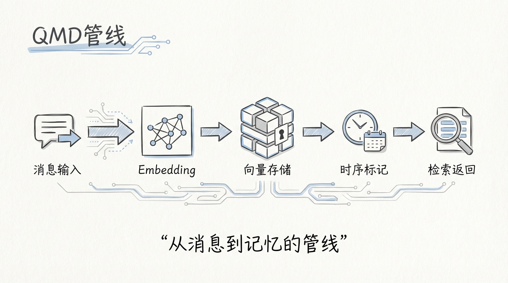
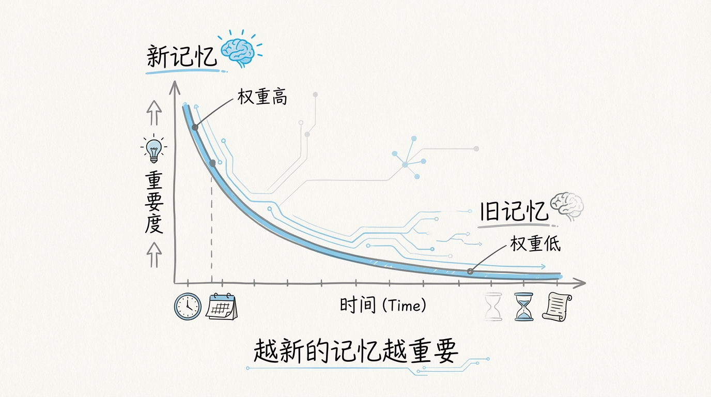
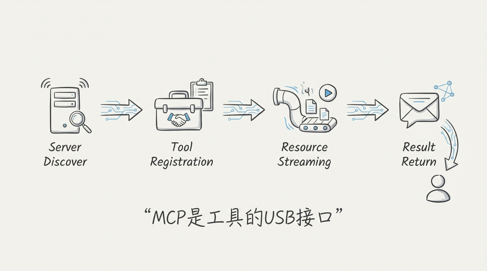
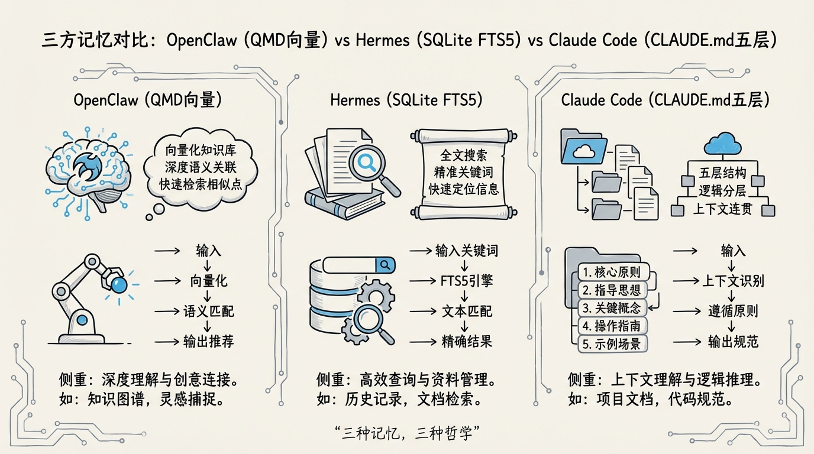

[English](docs/07-Memory-and-MCP.md)

# 07 记忆系统与 MCP：QMD 索引、时序衰减与工具协议

## AI 助手的记忆问题，比你想的要难

每个用过 ChatGPT 的人都体验过那种挫败感：昨天明明聊过的事情，今天它一脸茫然。你反复解释你的工作背景、你的偏好、你的项目上下文，像对一个每天都失忆的同事做入职培训。

这个问题的根源在于 LLM 的架构设计。**Transformer 没有原生的跨 session 持久记忆**，它的"记忆"就是当前 context window 里的内容。session 结束，一切归零。所有试图让 AI 助手"记住东西"的努力，都是在 LLM 外部搭建记忆基础设施。



OpenClaw 的做法是构建了一套叫 **QMD（Query-Memory-Decay）** 的记忆系统。这套系统和业界常见的"把聊天记录存数据库然后 RAG 检索"有本质区别：它引入了时序衰减因子，让记忆像人脑一样有遗忘曲线。最近的记忆权重高，陈旧的记忆权重低，不是简单的 FIFO 队列，而是一个**带衰减函数的优先级堆**。

## 1️⃣ QMD 架构三件套

QMD 系统的核心由三个文件构成，各自承担独立的职责：

```
src/memory/
├── manager.ts            # 记忆管理器：CRUD + 生命周期
├── qmd-process.ts        # 记忆处理器：Embedding + 索引构建
├── qmd-query-parser.ts   # 查询解析器：自然语言 → 结构化检索
├── temporal-decay.ts     # 时序衰减：遗忘曲线计算
├── embeddings/
│   ├── voyage.ts         # Voyage AI Embedding 适配
│   └── mistral.ts        # Mistral Embedding 适配
└── index.ts
```



### manager.ts：记忆的操作系统

`manager.ts` 是整个 QMD 系统的调度中心。你可以把它理解成记忆的**操作系统内核**，所有对记忆的读写操作都经过它。

它的核心职责：

- **记忆写入**：接收来自 Agent 对话的新记忆条目，分配唯一 ID，标记时间戳，触发 Embedding 计算
- **记忆检索**：接收查询请求，协调 query parser 和 decay 模块，返回排序后的结果
- **生命周期管理**：定期扫描过期记忆，根据衰减分数决定是归档还是删除
- **容量控制**：维护一个硬上限，当记忆条目数超过阈值时，淘汰衰减分数最低的条目

```typescript
// manager.ts 核心接口（简化）
export class MemoryManager {
  private store: MemoryStore;
  private processor: QMDProcessor;
  private decayEngine: TemporalDecayEngine;

  async remember(content: string, metadata: MemoryMeta): Promise<MemoryEntry> {
    const embedding = await this.processor.embed(content);
    const entry = {
      id: generateId(),
      content,
      embedding,
      createdAt: Date.now(),
      lastAccessedAt: Date.now(),
      accessCount: 0,
      decayScore: 1.0,
      metadata
    };
    await this.store.insert(entry);
    return entry;
  }

  async recall(query: string, topK: number = 10): Promise<MemoryEntry[]> {
    const parsed = this.queryParser.parse(query);
    const candidates = await this.store.search(parsed);
    return this.decayEngine.rankByRelevanceAndFreshness(candidates, topK);
  }
}
```

这段代码揭示了一个关键设计决策：**记忆检索不是纯粹的语义相似度排序**。`rankByRelevanceAndFreshness` 方法同时考虑了语义相关性和时间新鲜度。一条语义高度相关但三个月前的记忆，可能排在一条语义略相关但昨天刚产生的记忆后面。

### qmd-process.ts：从文本到向量

`qmd-process.ts` 负责将原始文本转化为可检索的向量索引。它的处理流水线：

```
原始文本 → 分块 (Chunking) → Embedding → 索引写入
```



分块策略采用**滑动窗口 + 语义边界检测**的混合方案。纯固定长度分块会在句子中间切断语义，纯语义分块计算开销大。OpenClaw 的做法是先按固定窗口粗切，再在窗口边界附近寻找最近的句号或换行符作为实际切分点。这个策略在切分质量和计算效率之间取得了平衡。

Embedding 层支持两个 provider：

| Provider | 维度 | 特点 | 适用场景 |
|----------|------|------|---------|
| **Voyage AI** | 1024 | 多语言支持强，检索精度高 | 生产环境默认选项 |
| **Mistral** | 1024 | 开源可自部署，延迟低 | 私有化部署、离线场景 |

provider 选择通过 `openclaw.json` 中的 `memory.embeddingProvider` 字段配置。如果配置了 API key 就用远程服务，没有就 fallback 到本地 Mistral 模型。这个 fallback 机制很重要，它意味着 OpenClaw 的记忆系统在完全离线的环境下也能工作，只是精度会有一定损失。

### qmd-query-parser.ts：自然语言到结构化检索

用户对记忆的查询是自然语言形式的，比如"上周我们讨论的数据库迁移方案"。`qmd-query-parser.ts` 的工作是将这种模糊的自然语言查询转化为结构化的检索条件。

```typescript
// 查询解析（简化）
interface ParsedQuery {
  semanticVector: number[];     // 语义向量，用于相似度检索
  timeConstraint?: TimeRange;   // 时间约束："上周"
  topicFilter?: string[];       // 主题过滤："数据库迁移"
  entityFilter?: string[];      // 实体过滤：人名、项目名
}
```

解析过程分两步：

1. **结构化信息提取**：通过正则和轻量 NLP 识别时间表达式、实体名称、主题关键词
2. **语义向量生成**：将去除结构化信息后的核心查询文本送入 Embedding 模型

这种混合检索策略比纯向量检索更精确。纯向量检索在面对"上周"这类时间约束时表现很差，因为 Embedding 模型对时间语义的编码能力有限。把时间约束提取出来做精确过滤，剩余部分再做语义检索，两者结合才能给出靠谱的结果。

## 2️⃣ 时序衰减：让记忆像人脑一样遗忘



`temporal-decay.ts` 是 QMD 系统中最有意思的设计。它实现了一个灵感来自 **Ebbinghaus 遗忘曲线** 的衰减函数。

### 衰减公式

```
decayScore = baseRelevance × e^(-λ × t) × (1 + α × log(1 + accessCount))
```

三个因子的含义：

- **`e^(-λ × t)`**：指数衰减项。`t` 是距离上次访问的时间，`λ` 是衰减速率。时间越久，分数越低
- **`(1 + α × log(1 + accessCount))`**：访问频次加成。被频繁访问的记忆衰减更慢，这模拟了人脑中"用进废退"的机制
- **`baseRelevance`**：基础语义相关度，来自 Embedding 相似度计算

`λ` 的默认值是 0.05，对应的半衰期约为 14 天。一条两周没被访问的记忆，其时间衰减因子降到约 0.5。一个月没被访问，降到约 0.22。三个月没被访问，基本接近零。

这个设计背后的洞察是：**AI 助手的记忆和人脑记忆面临相同的核心矛盾，存储空间有限，信息无限增长**。人脑通过遗忘来解决这个矛盾，记住重要的、常用的，忘掉不重要的、过时的。QMD 的时序衰减做的是完全一样的事情。

### 衰减触发时机

衰减分数不是实时计算的，而是在两个时机更新：

1. **检索时惰性计算**：每次 recall 时，对候选结果重新计算衰减分数。这保证了返回结果的新鲜度
2. **定期批量更新**：后台定时任务每小时扫描一次全量记忆，更新衰减分数，淘汰低于阈值的条目

惰性计算 + 批量更新的组合是一个经典的工程权衡。实时计算每条记忆的衰减分数开销太大，纯定时更新又会导致检索时结果不够新鲜。两者结合，检索路径上做轻量的惰性计算保证结果质量，后台批量更新负责垃圾回收。

## 3️⃣ MCP 集成：标准化的工具协议



**MCP（Model Context Protocol）** 是 Anthropic 提出的开放协议，定义了 AI 模型与外部工具之间的通信标准。OpenClaw 从早期就接入了 MCP，这使得它可以复用整个 MCP 生态中的工具和资源。

### Server 发现

OpenClaw 的 MCP 集成从 Server 发现开始。它支持三种发现方式：

```
MCP Server 发现
├── 静态配置     openclaw.json → mcp.servers[]
├── 目录发现     扫描 ~/.openclaw/mcp-servers/ 目录
└── 动态注册     运行时通过 API 注册临时 Server
```

静态配置是最常用的方式：

```json
{
  "mcp": {
    "servers": [
      {
        "name": "filesystem",
        "command": "npx",
        "args": ["-y", "@modelcontextprotocol/server-filesystem", "/home/user"],
        "env": {}
      },
      {
        "name": "github",
        "command": "npx",
        "args": ["-y", "@modelcontextprotocol/server-github"],
        "env": {
          "GITHUB_TOKEN": "${GITHUB_TOKEN}"
        }
      }
    ]
  }
}
```

环境变量使用 `${VAR_NAME}` 语法引用，在 Server 启动时做模板替换。这避免了在配置文件中硬编码密钥。

### Tool 注册

MCP Server 启动后，会通过 `tools/list` 方法向 OpenClaw 注册自己能提供的工具。注册过程：

```
Server 启动 → stdio/SSE 连接建立 → tools/list 请求
  → Server 返回工具清单（名称 + 描述 + JSON Schema）
  → OpenClaw 注册到全局工具表
  → 工具描述注入 system prompt
```

每个工具的描述和参数 schema 会被序列化后注入到 system prompt 中，让 LLM 知道有哪些工具可用、每个工具需要什么参数。这是 MCP 协议的核心价值：**工具的声明和实现分离**。LLM 只需要知道工具的接口描述，不需要知道工具是用什么语言实现的、运行在哪台机器上。

### Resource Streaming

MCP 的 Resource 机制允许 Server 暴露结构化数据资源。和工具调用不同，Resource 是**被动读取**的，Agent 可以按需拉取而不需要执行操作。

```
Resource 类型：
├── 文件资源     file:///path/to/doc.md
├── 数据库资源   db://schema/table
├── API 资源     api://service/endpoint
└── 自定义资源   custom://namespace/key
```

Resource Streaming 是 OpenClaw 对 MCP Resource 的增强实现。当资源体积较大时，OpenClaw 不会一次性加载全部内容到内存，而是通过流式读取分批送入 Agent 的处理管道。这对处理大型日志文件、数据库查询结果等场景至关重要。

## 4️⃣ 内置工具全景


OpenClaw 除了支持 MCP 外部工具，还内置了一套核心工具集。这些工具覆盖了 AI 助手日常操作的主要场景：

| 工具 | 功能 | 实现要点 |
|------|------|---------|
| **Browser** | 网页浏览、内容提取 | Headless Chromium，自动处理 JavaScript 渲染 |
| **Canvas** | 可视化画布，生成图表和草图 | SVG/Canvas API，支持 Mermaid 语法 |
| **Exec** | 执行 shell 命令 | 沙箱隔离，可配置 allow/deny 列表 |
| **Web Search** | 搜索引擎查询 | 支持 Google/Bing/DuckDuckGo 多引擎 |
| **Send** | 发送消息到外部渠道 | 邮件、Slack、Webhook、微信 |
| **Cron** | 定时任务调度 | cron 表达式，持久化到 SQLite |
| **Image Gen** | 图片生成 | 对接 DALL-E/Stable Diffusion/Midjourney API |
| **Media Analysis** | 图片/音频/视频分析 | 多模态模型推理，支持本地和远程 |

这些内置工具和 MCP 外部工具在 Agent 的视角里是**完全等价的**。Agent 不知道也不关心某个工具是内置的还是通过 MCP 注册的，它只看到一个统一的工具列表和每个工具的接口描述。这种设计让 OpenClaw 可以逐步将内置工具迁移到独立的 MCP Server，提高系统的可扩展性和可维护性。

### Exec 工具的安全设计

Exec 是所有内置工具中风险最高的，因为它直接执行 shell 命令。OpenClaw 对它做了多层防护：

```
命令提交
  ↓
黑名单模式匹配 → 命中 → 直接拒绝（rm -rf, dd if=, mkfs 等）
  ↓ 通过
白名单检查 → 命中 → 自动放行
  ↓ 未命中
权限模式判断 → Allow-All 模式 → 放行
              → Tool-Approval 模式 → 弹窗确认
              → RBAC 模式 → 检查角色权限
```

这个分层拦截机制和 Claude Code 的 42 条危险模式设计思路类似，但 OpenClaw 更进一步，把权限判断和 RBAC 角色体系打通了。一个 Guest 角色用户即使配置了白名单，也无法执行 Exec 工具，因为 RBAC 层在白名单检查之前就拦住了。

## 5️⃣ 与 Hermes Memory / Claude Code Memory 的对比



三套 AI 助手的记忆系统，代表了三种完全不同的设计哲学：

| 维度 | OpenClaw QMD | Hermes Memory | Claude Code Memory |
|------|-------------|---------------|-------------------|
| **存储引擎** | 向量数据库 + SQLite | SQLite FTS5 全文检索 | 纯文本文件（.md） |
| **检索方式** | 语义向量 + 时序衰减 | FTS5 关键词匹配 + BM25 | 全量注入 system prompt |
| **遗忘机制** | 指数衰减函数 | 无自动遗忘 | 手动管理 + 200 行上限 |
| **跨 session** | 原生支持 | 原生支持 | MEMORY.md + CLAUDE.md |
| **多用户** | 支持，按用户隔离 | 单用户 | 单用户 |
| **Embedding** | Voyage AI / Mistral | 无 | 无 |
| **检索精度** | 高（语义理解） | 中（关键词匹配） | 低（全量加载，靠 LLM attention） |
| **资源开销** | 高（向量计算 + 存储） | 低（纯 SQLite） | 极低（纯文件 I/O） |

**Hermes 的 SQLite FTS5 方案**是一个务实的选择。FTS5 是 SQLite 内置的全文检索引擎，支持 BM25 排序，不需要外部依赖，查询性能在万级文档量下完全够用。它的局限性在于无法做语义检索，"数据库迁移方案"和"DB migration plan"在 FTS5 看来是两个完全不相关的查询。

**Claude Code 的纯文本方案**走了另一个极端。CLAUDE.md 五层体系和 MEMORY.md 的设计极其简洁，所有记忆就是 markdown 文件，全量加载到 system prompt。检索？不存在的。LLM 自己在 200K context window 里找。这种方案在记忆量小的时候效率极高，零额外开销。但一旦记忆量增长到几千条，全量加载就不现实了。

**OpenClaw 的 QMD 方案**是工程复杂度最高的，向量计算、时序衰减、混合检索，每一层都有计算成本。但它也是三者中唯一能在大规模记忆下保持检索质量的方案。当你的 AI 助手积累了几个月的对话记忆、几百个项目上下文时，FTS5 的关键词匹配和全量加载都会力不从心。QMD 的语义检索 + 时序衰减才能在海量记忆中精准定位到当前最相关的信息。

### MCP 工具生态对比

| 维度 | OpenClaw | Hermes | Claude Code |
|------|---------|--------|-------------|
| **MCP 支持** | 完整支持 | 部分支持 | 完整支持 |
| **内置工具数** | 8+ | 5+ | 10+ |
| **工具权限** | RBAC 细粒度控制 | 全局开关 | 三模式（default/auto/plan） |
| **Resource Streaming** | 支持 | 不支持 | 支持 |
| **自定义工具** | MCP Server + 插件 API | 插件系统 | MCP Server + Skill |

MCP 作为工具协议的价值在于**消除了 vendor lock-in**。一个为 Claude Code 开发的 MCP Server 可以直接在 OpenClaw 中使用，反之亦然。这种互操作性让工具生态可以跨产品共享，所有实现了 MCP 协议的 AI 助手都能受益。

## 6️⃣ 记忆系统的工程启示

OpenClaw 的 QMD 系统给 AI 助手的记忆设计提供了一个有价值的参考实现。几个值得关注的设计决策：

**向量检索 vs 全文检索的选择**不是非此即彼的。OpenClaw 用语义向量做粗检索，用时间过滤和实体匹配做精筛，混合策略的效果显著优于单一策略。

**遗忘机制是必须的**。没有遗忘的记忆系统必然走向崩溃。要么存储爆炸，要么检索结果被过时信息淹没。QMD 的时序衰减是一种优雅的解决方案：不需要用户手动清理，系统自动让旧记忆渐渐褪色。

**MCP 协议的接入成本远低于自建工具体系**。OpenClaw 的 8 个内置工具如果全部自己从零开发，工程量巨大。通过 MCP 生态复用社区已有的 Server 实现，可以把精力集中在核心差异化功能上。

这套记忆系统的设计哲学可以用一句话概括：**让 AI 助手拥有和人脑类似的记忆特性，记住重要的、遗忘过时的、按需检索而不是全量加载**。

---

下一篇：[08-权限与部署](docs/08-权限与部署.md)
