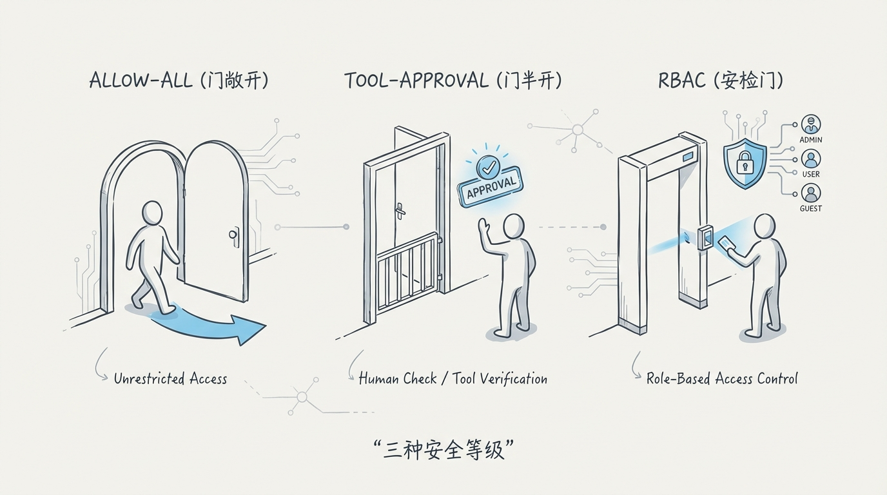
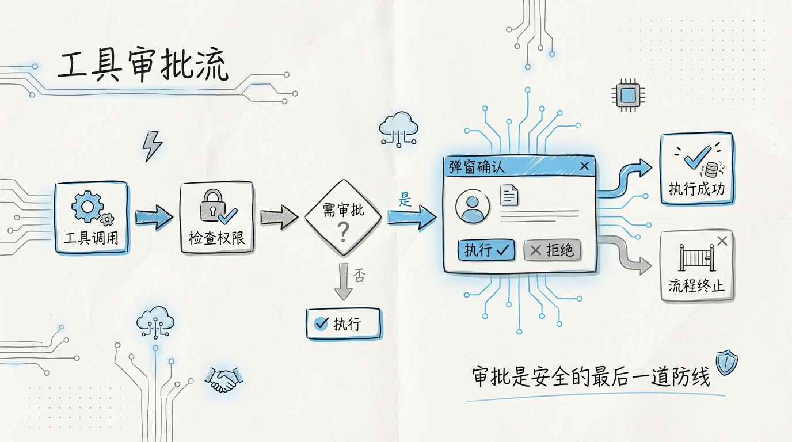
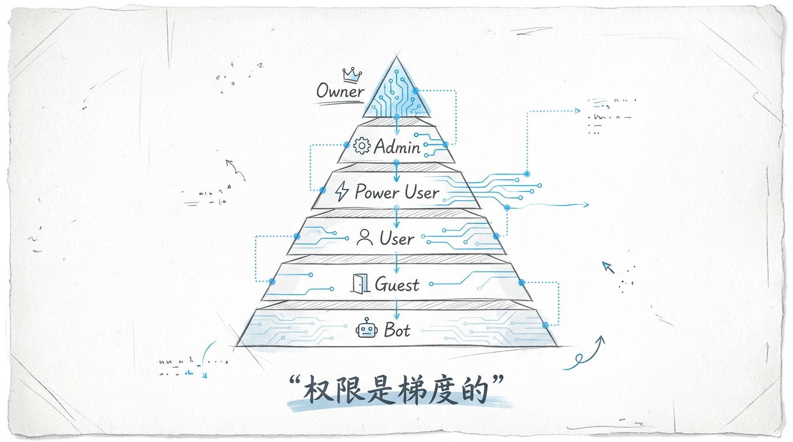
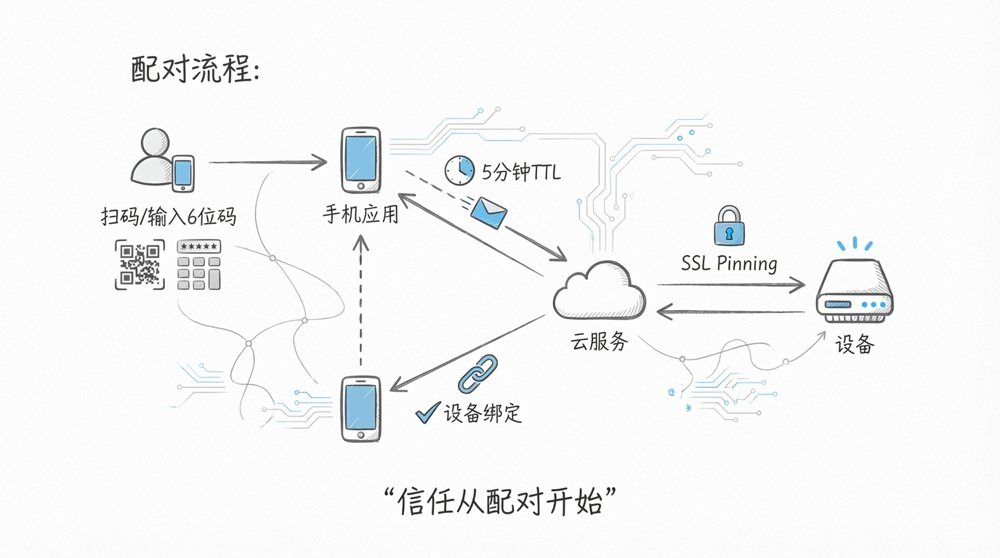
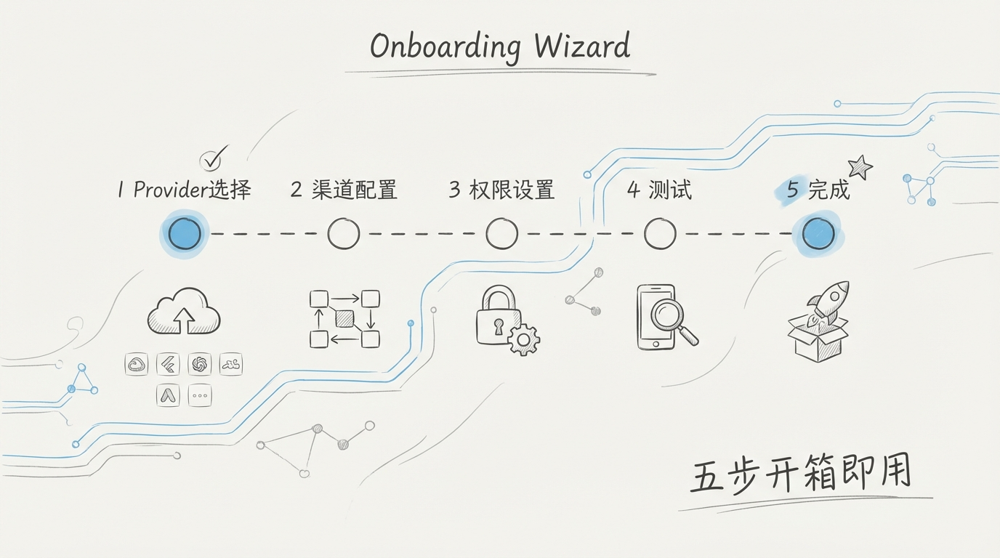
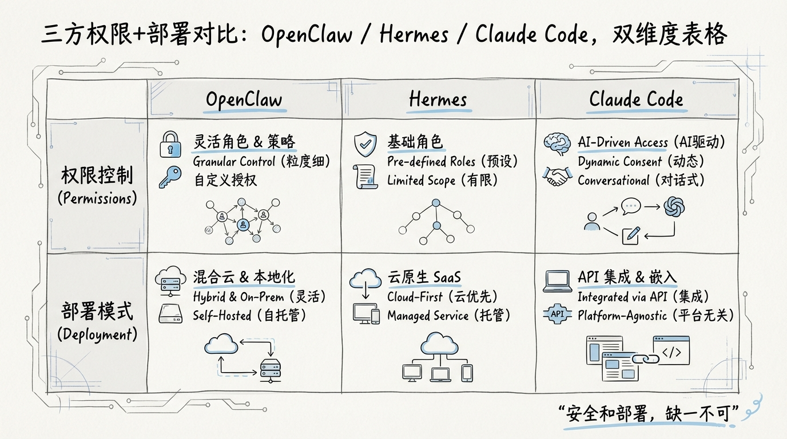

[English](docs/08-Permissions-and-Deployment.md)

# 08 权限系统与部署：三模式权限、配对码认证与多环境部署

## 权限是 AI 助手最容易被忽视的基础设施

大多数开源 AI 助手项目在权限上的投入约等于零。能跑起来就行，所有用户全量权限，所有工具随便调。这在单人本地使用的场景下没什么问题。但一旦 OpenClaw 被部署成团队共享服务，一旦有远程设备需要接入，一旦有不同信任级别的用户共存，权限就从"可选项"变成了"地基"。



地基打不好，上面盖什么都是危楼。

OpenClaw 的权限系统由三个互相独立又彼此协作的子系统构成：**三模式权限引擎**控制工具调用的审批流程，**RBAC 角色体系**定义谁能做什么，**Pairing Code 设备配对**解决远程设备的身份认证。三者组合在一起，形成了一个从身份认证到行为授权的完整安全链条。

## 1️⃣ 三模式权限引擎

OpenClaw 提供三种权限模式，适配不同的使用场景和安全需求：

| 模式 | 审批方式 | 适用场景 | 安全级别 |
|------|---------|---------|---------|
| **Allow-All** | 所有工具调用自动放行 | 本地单人开发、可信环境 | 低 |
| **Tool-Approval** | 每次工具调用需要用户确认 | 日常使用、涉及敏感操作 | 中 |
| **RBAC** | 基于角色的细粒度权限控制 | 团队部署、多用户共享 | 高 |

### Allow-All 模式

最简单的模式。Agent 的所有工具调用直接执行，不弹窗、不审批、不记录。

```
Agent 请求调用工具 → 直接执行 → 返回结果
```

这个模式的存在是为了**降低单人使用场景下的摩擦**。你在自己的笔记本上跑 OpenClaw，Agent 想读个文件还要弹窗确认，体验会很差。Allow-All 适合你完全信任 Agent 运行环境的场景。

但它有一个安全机制：即使在 Allow-All 模式下，一个硬编码的**不可覆盖黑名单**仍然生效。`rm -rf /`、`dd if=/dev/zero`、`mkfs` 这类毁灭性命令在任何模式下都不会被放行。这是最后一道保险。

### Tool-Approval 模式

中间地带。Agent 每次发起工具调用时，系统展示工具名、参数和预期影响，用户选择放行或拒绝：

```
Agent 请求调用 Exec("git push --force origin main")
  ↓
弹窗：
  工具: Exec
  命令: git push --force origin main
  影响: 将强制推送到远程 main 分支
  [Allow] [Deny] [Allow-All-For-This-Tool]
```

**Allow-All-For-This-Tool** 选项是一个体验优化。当你确认某个工具在当前 session 中是安全的，点一次就能跳过后续所有该工具的确认弹窗。session 结束后这个设置自动失效，不会留下永久性的权限口子。



### RBAC 模式

面向团队部署的权限模式。每个用户有一个角色，角色决定了可以使用哪些工具、可以访问哪些资源。

RBAC 模式下，工具调用的判断流程：

```
Agent 请求调用工具
  ↓
获取当前用户角色
  ↓
查询角色权限表 → 工具在允许列表中？
  ↓ 是                    ↓ 否
检查参数约束              拒绝并记录
  ↓ 通过
执行工具调用
```

RBAC 模式和 Tool-Approval 模式可以叠加使用。即使用户的角色允许使用某个工具，系统仍然可以配置为需要用户确认。这给管理员提供了更精细的控制粒度。

## 2️⃣ 角色体系：六级权限梯度



OpenClaw 定义了六个角色级别，从最高权限到最低权限：

```
Owner          ★★★★★★  系统所有者，拥有一切权限
  ↓
Admin          ★★★★★☆  管理员，可以管理用户和配置
  ↓
Power User     ★★★★☆☆  高级用户，可以使用所有工具
  ↓
User           ★★★☆☆☆  普通用户，使用核心工具集
  ↓
Guest          ★★☆☆☆☆  访客，只读 + 有限交互
  ↓
Bot            ★☆☆☆☆☆  自动化账户，受限的工具子集
```

每个角色的权限范围：

| 角色 | 对话 | 核心工具 | Exec | 系统配置 | 用户管理 | MCP Server 管理 |
|------|------|---------|------|---------|---------|----------------|
| **Owner** | ✅ | ✅ | ✅ | ✅ | ✅ | ✅ |
| **Admin** | ✅ | ✅ | ✅ | ✅ | ✅ | ❌ |
| **Power User** | ✅ | ✅ | ✅ | ❌ | ❌ | ❌ |
| **User** | ✅ | ✅ | ❌ | ❌ | ❌ | ❌ |
| **Guest** | ✅ | 部分 | ❌ | ❌ | ❌ | ❌ |
| **Bot** | ✅ | 部分 | 部分 | ❌ | ❌ | ❌ |

**Bot 角色**的设计值得单独说。它是给自动化场景准备的，比如 CI/CD 流水线中调用 OpenClaw API、定时任务触发的 Agent 操作。Bot 可以执行一个白名单内的 Exec 命令子集，但不能做任何用户管理或系统配置操作。这防止了一个被入侵的自动化脚本通过 Bot 账户提权。

**角色不支持自定义**。这是一个刻意的设计约束。自定义角色会引入组合爆炸的权限矩阵，增加配置出错的概率。六个预定义角色覆盖了绝大多数使用场景。如果确实需要更精细的控制，可以在角色基础上通过 `permissions` 字段对特定工具做 allow/deny 覆盖。

## 3️⃣ Pairing Code 设备配对

远程设备接入 OpenClaw 实例需要一个安全的身份认证机制。OpenClaw 选择了 **Pairing Code** 方案，同时支持 QR 码扫描和 6 位数字码手动输入。

### 配对流程

```
                    OpenClaw 实例                     远程设备
                         │                              │
                         │◄── 1. 请求配对 ──────────────│
                         │                              │
                    2. 生成 Pairing Code                │
                    (6位随机字母数字 + QR)               │
                         │                              │
                         │── 3. 展示 Code/QR ──────────►│
                         │                              │
                         │◄── 4. 用户在设备端输入 Code ──│
                         │                              │
                    5. 验证 Code                         │
                    生成设备证书                          │
                    绑定角色                              │
                         │                              │
                         │── 6. 返回证书 + 会话 Token ──►│
                         │                              │
                    配对完成，SSL Pinning 生效            │
```



### 安全机制

**5 分钟 TTL**。Pairing Code 从生成开始计时，5 分钟后自动失效。这限制了窗口攻击的时间。即使攻击者截获了 Code，也必须在 5 分钟内完成配对才有效。

**单次使用**。每个 Code 只能用于一次成功的配对。配对成功后 Code 立即作废，哪怕 5 分钟 TTL 还没到。

**频率限制**。同一设备在 10 分钟内最多发起 3 次配对请求。连续失败 5 次后锁定 30 分钟。这防止了暴力枚举。6 位字母数字混合码的组合空间是 `36^6 ≈ 21 亿`，配合频率限制，暴力破解在计算上不可行。

**SSL Pinning**。配对成功后，设备和实例之间的通信通道会绑定到特定的 TLS 证书。即使网络中存在中间人代理，只要中间人无法伪造被 pinning 的证书，通信就是安全的。

这套配对方案和 Apple 的 AirDrop 配对、Chromecast 设备配对在设计思路上高度相似：**用一个短时效、低熵但对人友好的临时凭证建立初始信任，然后立即切换到高安全性的持久凭证**。

## 4️⃣ openclaw.json 配置系统

OpenClaw 的所有运行时行为都可以通过配置控制。`openclaw.json` 是核心配置文件，支持完整的 JSON Schema 验证。

### 配置结构

```json
{
  "server": {
    "host": "0.0.0.0",
    "port": 3000,
    "ssl": {
      "enabled": true,
      "cert": "/etc/openclaw/ssl/cert.pem",
      "key": "/etc/openclaw/ssl/key.pem"
    }
  },
  "auth": {
    "mode": "pairing",
    "pairingTTL": 300,
    "sessionTimeout": 86400
  },
  "permissions": {
    "mode": "rbac",
    "defaultRole": "user"
  },
  "memory": {
    "embeddingProvider": "voyage",
    "decayLambda": 0.05,
    "maxEntries": 10000
  },
  "mcp": {
    "servers": []
  },
  "llm": {
    "provider": "openai-compatible",
    "baseUrl": "https://api.example.com/v1",
    "model": "gpt-4",
    "apiKey": "${LLM_API_KEY}"
  }
}
```

### 配置优先级

```
优先级从高到低：

CLI 参数          openclaw --port 8080
  ↓ 覆盖
环境变量          OPENCLAW_SERVER_PORT=8080
  ↓ 覆盖
JSON 配置文件     openclaw.json → server.port: 3000
  ↓ 覆盖
内置默认值        hardcoded defaults
```

这个优先级链条和绝大多数 12-Factor App 的配置惯例一致：**越具体、越临时的配置优先级越高**。CLI 参数是一次性的，环境变量是部署环境级的，JSON 文件是项目级的，默认值是代码级的。

环境变量名的映射规则是将 JSON 路径中的 `.` 替换为 `_`，全部大写，加 `OPENCLAW_` 前缀。`server.port` 对应 `OPENCLAW_SERVER_PORT`，`memory.decayLambda` 对应 `OPENCLAW_MEMORY_DECAYLAMBDA`。

**`${VAR}` 模板语法**允许在 JSON 配置文件中引用环境变量。API Key 等敏感信息不应该硬编码在配置文件中，通过模板引用环境变量，配置文件可以安全地提交到 Git。

## 5️⃣ Onboarding Wizard



第一次启动 OpenClaw 时，`onboarding wizard` 会引导用户完成初始配置。这个向导不是花瓶，它解决的是一个真实的问题：OpenClaw 的配置项超过 50 个，新用户面对一个空白的 `openclaw.json` 会完全不知道从哪里开始。

向导的流程：

```
1️⃣  选择部署模式
    ├── 本地模式（单人使用）
    ├── 服务器模式（多人共享）
    └── Docker 模式（容器化部署）

2️⃣  配置 LLM 连接
    ├── 选择 Provider（OpenAI / Anthropic / OpenAI-Compatible）
    ├── 输入 API Key
    └── 测试连接

3️⃣  配置权限模式
    ├── Allow-All（推荐本地模式）
    ├── Tool-Approval（推荐日常使用）
    └── RBAC（推荐服务器模式）

4️⃣  配置记忆系统
    ├── Embedding Provider（Voyage AI / Mistral / 跳过）
    └── 记忆容量设置

5️⃣  生成 openclaw.json
    └── 写入配置文件，启动服务
```

向导的每一步都有合理的默认值。一个不想深入配置的用户，可以全程按回车，5 步之内就能跑起来一个可用的实例。这种**渐进式披露**的设计理念：默认配置就能工作，高级选项在你需要的时候再暴露。

## 6️⃣ 多环境部署

OpenClaw 支持五种部署方式，覆盖了从个人笔记本到生产集群的全部场景：

### npm 全局安装

```bash
npm install -g openclaw
openclaw init
openclaw start
```

最简单的部署方式，适合快速体验。依赖 Node.js 18+ 环境。

### Docker 部署

```dockerfile
FROM node:20-slim
WORKDIR /app
COPY package*.json ./
RUN npm ci --production
COPY . .
EXPOSE 3000
CMD ["node", "dist/server.js"]
```

```bash
docker run -d \
  --name openclaw \
  -p 3000:3000 \
  -v openclaw-data:/app/data \
  -e OPENCLAW_LLM_APIKEY=sk-xxx \
  openclaw/openclaw:latest
```

Docker 部署的关键是数据持久化。`/app/data` 目录包含 SQLite 数据库、记忆索引、配置文件，必须挂载 volume。不挂载的话，容器重启所有数据归零。

### NixOS 部署

```nix
{
  services.openclaw = {
    enable = true;
    port = 3000;
    settings = {
      permissions.mode = "rbac";
      memory.embeddingProvider = "mistral";
    };
  };
}
```

NixOS 的声明式配置和 OpenClaw 的 JSON 配置完美契合。Nix 用户可以在 `configuration.nix` 中直接写 OpenClaw 的配置，`nixos-rebuild switch` 一步到位。

### systemd 服务

```ini
[Unit]
Description=OpenClaw AI Assistant
After=network.target

[Service]
Type=simple
User=openclaw
WorkingDirectory=/opt/openclaw
ExecStart=/usr/bin/node dist/server.js
Restart=always
RestartSec=5
Environment=NODE_ENV=production
EnvironmentFile=/etc/openclaw/env

[Install]
WantedBy=multi-user.target
```

systemd 部署适合传统的 Linux 服务器。`EnvironmentFile` 指向一个包含 API Key 等敏感配置的文件，权限设为 `600`，只有 openclaw 用户可读。

### launchd 服务（macOS）

```xml
<?xml version="1.0" encoding="UTF-8"?>
<!DOCTYPE plist PUBLIC "-//Apple//DTD PLIST 1.0//EN"
  "http://www.apple.com/DTDs/PropertyList-1.0.dtd">
<plist version="1.0">
<dict>
  <key>Label</key>
  <string>com.openclaw.agent</string>
  <key>ProgramArguments</key>
  <array>
    <string>/usr/local/bin/node</string>
    <string>/opt/openclaw/dist/server.js</string>
  </array>
  <key>RunAtLoad</key>
  <true/>
  <key>KeepAlive</key>
  <true/>
</dict>
</plist>
```

macOS 用户通过 launchd 实现开机自启。`KeepAlive` 设为 true 保证进程崩溃后自动重启。

### 五种部署方式对比

| 部署方式 | 适用场景 | 复杂度 | 隔离性 | 自动重启 |
|---------|---------|--------|--------|---------|
| **npm** | 快速体验、开发调试 | ★☆☆☆☆ | 无 | ❌ |
| **Docker** | 生产部署、团队使用 | ★★☆☆☆ | 容器级 | ✅ |
| **NixOS** | 声明式运维 | ★★★☆☆ | 系统级 | ✅ |
| **systemd** | 传统 Linux 服务器 | ★★☆☆☆ | 进程级 | ✅ |
| **launchd** | macOS 桌面常驻 | ★★☆☆☆ | 进程级 | ✅ |

## 7️⃣ 与 Hermes / Claude Code 的权限与部署对比



### 权限系统对比

| 维度 | OpenClaw | Hermes | Claude Code |
|------|---------|--------|-------------|
| **权限模式** | Allow-All / Tool-Approval / RBAC | 全局开关（开/关） | default / auto / plan |
| **角色体系** | 6 级角色梯度 | 无 | 无 |
| **设备认证** | Pairing Code（QR + 6 位码） | 无 | 无（本地 CLI） |
| **工具级控制** | 按角色 + 按工具 | 全局 | 按工具 allow/deny |
| **ML 辅助审批** | 无 | 无 | YOLO 分类器 |
| **多用户支持** | 原生支持 | 不支持 | 不支持 |

三个产品在权限设计上的差异，本质上反映了**产品定位的差异**。

Claude Code 是个人 CLI 工具，它的权限系统假设只有一个用户，核心矛盾是"让 Agent 自主"和"防止 Agent 搞破坏"之间的平衡。YOLO 分类器用 ML 来自动化这个判断，是一个面向个人用户体验的优化。

Hermes 是轻量级的个人助手，权限设计极度简化，一个全局开关，开就全部放行，关就全部拦截。简单到不可能配错。

OpenClaw 定位为可以团队共享的 AI 助手平台。多用户、多角色、远程设备接入，这些需求决定了它必须有 RBAC、必须有设备认证、必须有细粒度的权限控制。复杂度更高，但场景覆盖面也更广。

### 部署方式对比

| 维度 | OpenClaw | Hermes | Claude Code |
|------|---------|--------|-------------|
| **npm 安装** | ✅ | ✅ | ✅ |
| **Docker** | ✅ 官方镜像 | ✅ | ❌ |
| **NixOS** | ✅ flake | ❌ | ❌ |
| **systemd** | ✅ unit 文件 | ❌ | ❌ |
| **launchd** | ✅ plist | ❌ | ❌ |
| **配置系统** | openclaw.json + ENV + CLI | 环境变量 | settings.json + CLAUDE.md |
| **Onboarding** | 交互式向导 | 无 | 无（/init 命令） |
| **配置优先级** | CLI > ENV > JSON > defaults | ENV > defaults | 文件固定 |
| **热更新** | 部分配置支持 | 不支持 | 不支持 |

OpenClaw 在部署方式的多样性上领先明显。五种部署方式覆盖了几乎所有主流的运行环境。交互式 onboarding wizard 大幅降低了首次部署的门槛。

Claude Code 作为 CLI 工具，部署就是 `npm install`，不需要考虑 Docker、systemd 这些服务化的问题。它的配置系统也相对简单，`settings.json` 加上多层 CLAUDE.md 基本就够了。

Hermes 走极简路线，环境变量配置完事。这种方案在 Docker 和 Kubernetes 环境下反而最友好，因为 K8s 原生就用环境变量和 ConfigMap 做配置注入。

## 8️⃣ 安全设计的工程哲学

OpenClaw 的权限系统和部署架构揭示了一个 AI 助手平台在安全设计上的核心挑战：**如何在开放性和安全性之间找到可持续的平衡点**。

太开放，一个恶意的 prompt injection 就能让 Agent 删库跑路。太封闭，Agent 连个文件都读不了，沦为一个昂贵的聊天框。

OpenClaw 的回答是**分层防御**。Pairing Code 解决"谁在连接"的问题。RBAC 角色解决"谁能做什么"的问题。三模式权限解决"每次操作是否放行"的问题。三层叠加，任何一层被突破都不会导致系统完全失守。

这和网络安全中的**纵深防御**原则完全一致。防火墙、WAF、应用层鉴权、数据库权限，每一层都假设前一层可能被突破。OpenClaw 把同样的思路应用到了 AI Agent 安全领域。

配置系统的设计也体现了工程上的务实。四级配置优先级、环境变量模板、交互式向导，这些都不是什么创新技术，而是经过几十年验证的配置管理最佳实践。OpenClaw 把它们完整地落地到一个 AI 助手产品中，这件事本身就说明了团队对工程质量的追求。

AI 助手的安全问题只会越来越重要。随着 Agent 被赋予越来越多的执行能力，从读写文件到操作数据库到调用外部 API，权限系统的设计质量直接决定了你敢不敢把它放进生产环境。OpenClaw 的实现不完美，但它至少给出了一个认真思考过的答案。

---

系列完结。回到：[首页](/)
